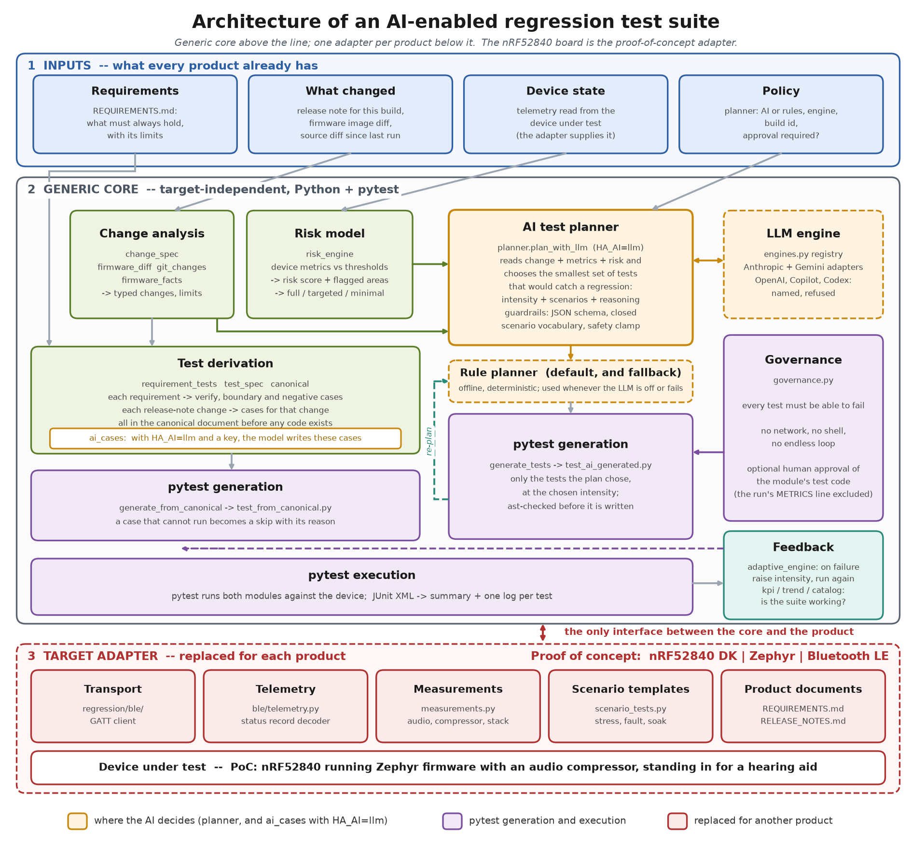
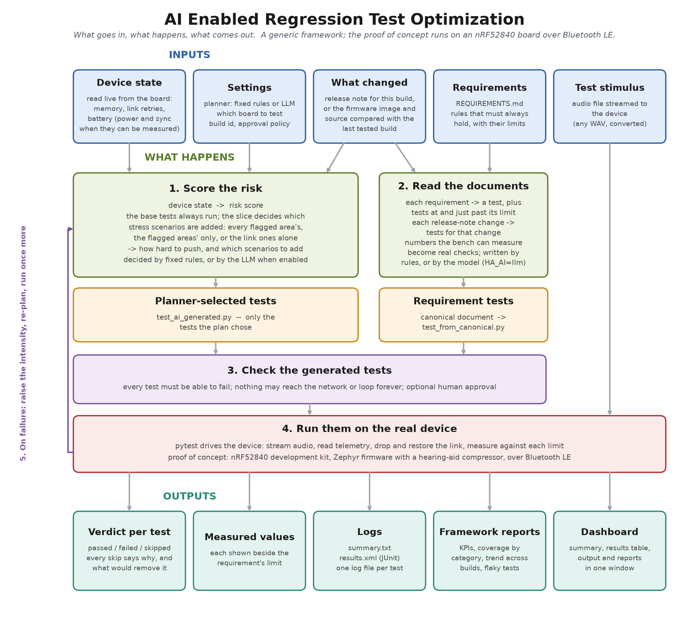
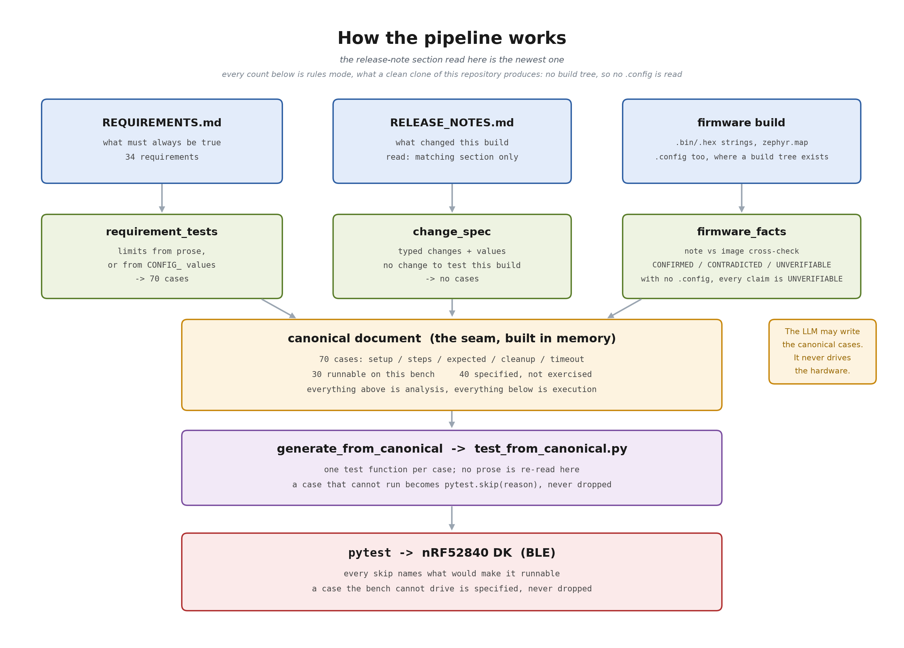
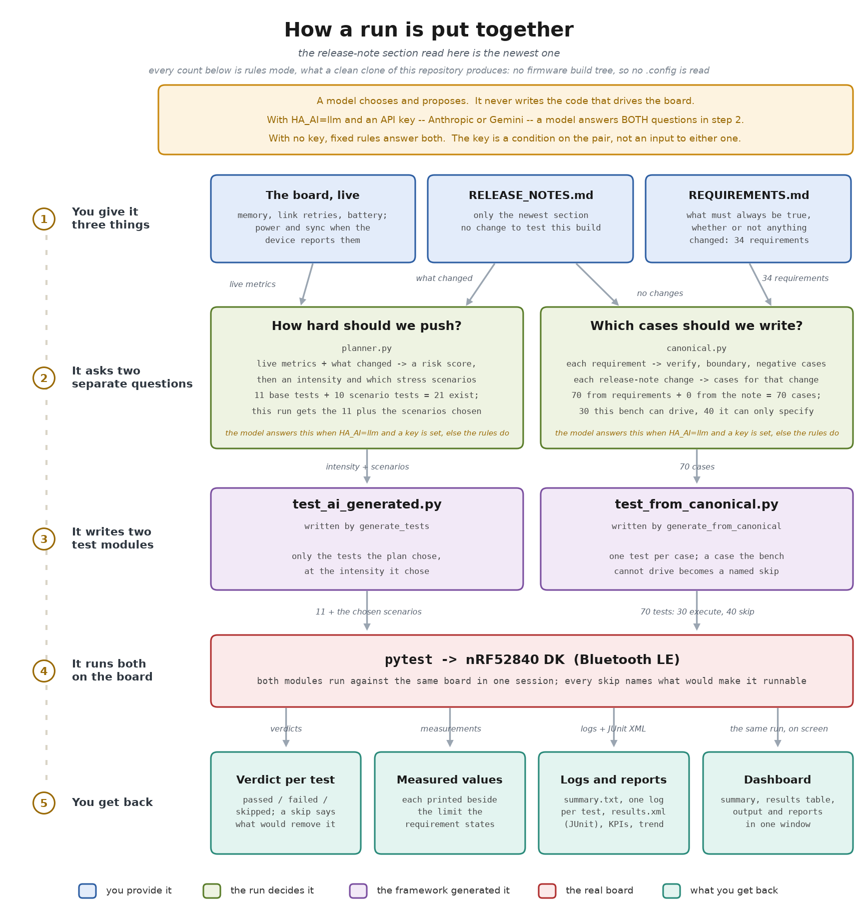

# AI Enabled Regression Test Optimization

An open-source reference for **using AI to decide which regression tests a
change actually needs, and for automating those tests end to end with
pytest** — on real hardware, not in a simulator.

Running the whole regression suite on every build is the safe answer and
the slow one. Hardware makes it slower still: one board, one connection,
minutes per test. The usual workaround — a person picks a subset — is fast
and unrepeatable. This project shows a third way:

1. **Read the evidence** — what changed in this build, and what state the
   device is in.
2. **Let an AI planner choose** the smallest set of tests, and the stress
   intensity, that would catch a regression in *that* change — within
   guardrails that stop it choosing anything the framework cannot run.
3. **Generate the chosen tests as a pytest module**, check it mechanically,
   and run it against the device.
4. **Escalate on failure** and record every run, so the framework can say
   whether it is working.

Alongside the AI-selected tests, every requirement and every release-note
change becomes pytest cases automatically, so traceability is generated
rather than maintained by hand.

> **Proof of concept.** The framework is target-independent. To show that
> it works on real hardware, it is applied to a **Nordic nRF52840
> development board** running Zephyr firmware — an audio compressor that
> stands in for a hearing aid — reached over Bluetooth Low Energy. The
> board is the demonstration, not the subject: everything specific to it
> is collected in the adapter layer, the base test templates and the two
> entry points that build the transport (see
> [Porting to another target](#porting-to-another-target)).

---

## Contents

- [Architecture](#architecture)
- [Where the AI is used, and where it is not](#where-the-ai-is-used-and-where-it-is-not)
- [Quick start](#quick-start)
- [How a run works](#how-a-run-works)
- [Requirement and release-note tests](#requirement-and-release-note-tests)
- [Framework instrumentation](#framework-instrumentation)
- [Porting to another target](#porting-to-another-target)
- [The proof of concept: nRF52840](#the-proof-of-concept-nrf52840)
- [Repository layout](#repository-layout)
- [Configuration](#configuration) · [Output](#output) · [Continuous integration](#continuous-integration) · [Building the executable](#building-the-executable)
- [Known limitations](#known-limitations) · [Documentation](#documentation) · [Licence](#licence)

---

## Architecture



The suite is three layers.

| Layer | What it is | Changes for another product? |
|---|---|---|
| **1. Inputs** | What every product already has: requirements, a release note or a diff saying what changed, device state, and the team's policy (AI or rules, approval required or not). | Content only |
| **2. Generic core** | Change analysis, risk model, **AI test planner** (with a rule-based fallback), test derivation, pytest generation, governance, execution, escalation and KPIs. Pure Python and pytest. | No |
| **3. Target adapter** | How to talk to the device, decode its telemetry, measure it, and the scenario templates that exercise it. | Yes — this is the port |

The core calls the adapter rather than the hardware. Three places still
name the proof of concept directly: `ai_engine/orchestrator.py` and
`dashboard.py` construct the BLE device, and the base test templates in
`ai_engine/generate_tests.py` are written against it. Everything else is
target-independent.

---

## Where the AI is used, and where it is not

The AI makes **two decisions**, and only when `HA_AI=llm`. The first is
*given this change and this device state, which tests are worth running,
and how hard?* — the planner, and the one a human would otherwise make by
judgement, so it is where test optimisation happens. The second is the
requirement and release-note cases themselves (`HA_CASE_SOURCE`, default
`auto`), where the model reads both documents and writes the cases the
rules would otherwise derive. Without `HA_AI=llm` everything below is
rules, and no model is called whatever `HA_CASE_SOURCE` says.

| Stage | Who decides | Why |
|---|---|---|
| **Test selection and intensity** | **AI planner** (`HA_AI=llm`) — an LLM reads the change, the metrics and the risk score and returns a plan with its reasoning | Judgement over free-form evidence is what a language model is good at, and what threshold rules do poorly |
| Test selection, fallback | Rule planner (default) | Works with no key, no network and no cost; the planner falls back to it on any LLM failure |
| Risk score | Threshold table (`risk_engine.py`) | A score must be traceable to a specific comparison |
| Reading requirements and release notes | Deterministic parsers by default; the model with `HA_AI=llm` (`HA_CASE_SOURCE`) | The determinism KPI requires the same input to produce the same suite, which only the parsers guarantee — so the model writing the cases is opt-in, and the derived cases stay as the fallback |
| Writing test code | Templates | The model never writes executable code; it chooses from a closed vocabulary |
| Running tests | pytest | — |

**Guardrails on the AI.** The LLM's answer is constrained by a JSON schema
whose scenario list is an enum over the scenarios the generator can emit,
so a scenario that would generate nothing cannot be expressed. The returned
plan is intersected with that vocabulary again and its packet count is
clamped, so a plan can never overload the device. Every generated module,
including an escalated re-run, is checked against the governance rules;
with `HA_REQUIRE_APPROVAL=1` a violation or a missing approval stops it.

**Model engines.** `regression/ai_engine/engines.py` is the seam for model
providers, and two adapters are written. Anthropic (`HA_ENGINE=anthropic`,
the default, model `claude-opus-5`) wraps `llm_client.py` and needs the
`anthropic` package. Google Gemini (`HA_ENGINE=gemini`, model
`gemini-3.6-flash`) is `gemini_client.py`, HTTPS requests built on the
standard library, so it needs no package beyond `requirements.txt`.
`openai`, `copilot` and `codex` are names in the registry with no adapter
behind them: asking for one fails saying exactly that, rather than quietly
planning with whichever engine happened to be the default.

**Rules are the default on purpose.** A fresh clone and a CI runner must
work with no credential. Switching the planner is one setting — the
dashboard's *With API* option, or `HA_AI=llm`. Execution, governance,
reporting and the KPIs are identical either way, which is what makes the
two comparable; what differs is the plan, and who wrote the requirement
cases.

---

## Quick start

All commands run from `src/`.

**Without hardware** — the framework's own test suite. A clean clone
collects 689 tests, of which 686 pass and 3 skip: all three skips need the
optional `anthropic` package from `requirements-llm.txt`.

```bash
cd src
pip install -r requirements.txt
python -m pytest tests/ -q
```

The versions in `requirements.txt` are compatibility floors, not the
versions to install; `CREDITS.md` lists the versions this release is
actually tested against.

**With the proof-of-concept board** powered on and advertising:

```bash
python -m regression.dashboard                  # GUI: Scan, choose the board, START REGRESSION
python -m regression.ai_engine.orchestrator     # the same pipeline, headless
```

**With the AI planner:**

```bash
pip install -r requirements-llm.txt             # adds anthropic
HA_AI=llm python -m regression.ai_engine.orchestrator

HA_AI=llm HA_ENGINE=gemini python -m regression.ai_engine.orchestrator   # no extra package
```

Headless options: `--release-note PATH`, `--build-id ID`, `--change "text"`
(overrides the derived change description), and `--metrics '{"power": 40,
"memory": 3.1, "sync": 10, "retry": 0}'` to use supplied metrics instead of
reading them from the device. The generated suite still runs on the board.

A packaged Windows build needs no Python at all: `bin/` holds
`AI_Enabled_Regression_Test_Optimization.exe` and `bin/User_Guide.pdf`
describes operating it.

---

## How a run works



1. **Work out what changed.** A release note section for the build on the
   board, if one is given. Otherwise the firmware image is compared with
   the last tested build (`firmware_diff.py`), then the source tree
   (`git_changes.py`). A change that cannot be worked out is reported as
   unknown rather than as "no change"; the plan then rests on the
   measurements alone.
2. **Read the device state** through the adapter — for the PoC, memory,
   link drops, battery, and power and sync where an instrument exists.
3. **Score the risk** and choose a slice — full, targeted or minimal. The
   slice decides which flagged areas contribute stress scenarios; the base
   tests run either way.
4. **Plan** — the AI planner, or the rules — the intensity and the
   scenarios.
5. **Generate** `test_ai_generated.py` from the plan, and
   `test_from_canonical.py` from the requirements and release note.
6. **Check** the generated suite against the governance rules.
7. **Run** both modules with pytest against the device.
8. **Escalate** on failure: raise the intensity, re-plan, run once more.
9. **Record** the run for the KPIs and the trend.

### Risk model

`METRIC_THRESHOLDS` in `regression/change_detection/risk_engine.py` is the
only place these numbers are written. The generated tests derive their
pass/fail bounds from the same table, so a metric cannot be scored against
one limit and judged against another. `power` and `sync` are uncalibrated
— the bench can measure neither — and both figures are the ones
REQ-PWR-001 and REQ-SYN-001 state.

| Metric (PoC) | Threshold | Weight | Flags |
|---|---|---|---|
| power | > 60 mA | 2 | `battery`, `power_stability` |
| memory | > 3.76 KiB of work-queue stack | 2 | `memory_leak`, `stability` |
| sync | > 50 ms | 1 | `connection`, `sync` |
| retry | > 5 unexpected link drops in the run | 1 | `retry`, `reconnect` |

| Score | Slice |
|---|---|
| 4 or more | Full: every flagged area's scenarios |
| 2–3 | Targeted: the flagged areas' scenarios |
| 0–1 | Minimal: link scenarios only |

The base tests always run; the slice decides which stress scenarios are
added. Memory and power scenarios follow their own metrics, and words in
the change description add scenarios, whatever the slice.

A metric the device does not report scores its full weight, the same as a
breach: not knowing whether power is within budget is not evidence that it
is. The console lists breached and unmeasured metrics separately.

Only `memory` is calibrated, from 24 samples of a known-good build — but
it was calibrated against the metric as it read before `ef509275`, when the
high-water sampled whichever thread happened to call in and sat at 3.53 KiB.
That build made the metric sample the work queue explicitly, and it now
reads about 0.52 KiB, so the 3.76 KiB limit is far above anything the
current metric produces and awaits recalibration. The others are
provisional until an instrument can measure them — see
[Known limitations](#known-limitations). The metrics and weights are the
part of the risk model a new target replaces.

### Planning

`regression/ai_engine/planner.py` returns a `RegressionPlan`: an
intensity, a list of scenarios, and the reasoning.

The intensity is written into the generated module and sets how hard the
stress scenarios push:

| Intensity | Packets | Streams (memory / power stress) | Reconnect cycles |
|---|---|---|---|
| low | 20 | 5 / 3 | 2 |
| medium | 50 | 12 / 6 | 3 |
| high | 80 (the ceiling for any plan) | 20 / 10 | 5 |

The **AI planner** receives the metrics (with unmeasured ones named as
such), the change description, the risk engine's score and flagged areas,
and the last five runs (build, verdict, intensity, scenarios and the tests
that failed). Its instructions quote the risk engine's limits, so the model
and the rules apply the same numbers, and tell it to prefer the lowest
intensity the evidence allows, since every step up costs bench time.

The **rule planner** uses the risk engine's limits. It chooses `high` when
the change mentions Bluetooth or power is over its limit, `medium` when
memory is over its limit or power or memory is unmeasured, otherwise `low`.
Scenarios are added from the metrics, the flagged areas, and words in the
change description (`CHANGE_TRIGGERS`).

On failure the run is re-planned with the next intensity as a floor, so an
escalated run is always harder than the one that failed.

### Generated tests

Always generated for the PoC:

| Test | Checks |
|---|---|
| `test_connection` | The device is reachable |
| `test_audio_stream_basic` | Audio streams and something comes back |
| `test_audio_dsp` | The DSP altered the signal; SNR within 0–50 dB |
| `test_audio_latency` | First-byte round trip within budget |
| `test_compression_curve` | Quiet gain exceeds loud gain by at least 1.25× |
| `test_no_samples_lost` | Every sample sent came back |
| `test_full_scale_no_clipping` | No int16 overflow at high volume |
| `test_power` / `memory` / `sync` / `retry` | Metric bounds |

Added when the plan selects them:

| Scenario | Category | What it catches |
|---|---|---|
| `reconnect_stress` | fault_injection | Recovery code that has never actually run |
| `fault_link_drop` | fault_injection | A link lost mid-transfer, and whether the stream recovers |
| `stress_stability` | stress | Where the throughput limit is, and whether crossing it is graceful |
| `memory_pressure` | stress | Memory that climbs across repeated streams and never returns |
| `power_stress` | stress | Current draw under sustained streaming (needs an external analyser) |
| `long_duration_stability` | long_duration | Leaks, counter overflow and drift — `HA_LONG_MINUTES` sets the soak |
| `concurrency_stream_and_read` | concurrency | Telemetry read during streaming: both pass alone, neither under overlap |
| `pairing_bonding` | security | Whether encryption is enforced, and whether a bond survives reconnection |

A test holds the planner's vocabulary and the generator's templates in
step, so the AI cannot select a scenario that emits nothing. The generated
module is checked with `ast.parse()` before it is written.

---

## Requirement and release-note tests

Every run writes a second pytest module, `test_from_canonical.py`, from two
documents, through one intermediate document:

```
REQUIREMENTS.md   --> requirement_tests.py --+
                                             +--> canonical document --> test_from_canonical.py
RELEASE_NOTES.md  --> change_spec.py --------+   (canonical.py, in memory)  (generate_from_canonical.py)
```

The canonical document is the seam between analysis and execution. It is
built in memory on every run and never saved: the orchestrator passes it
straight to the generator, so what it describes is always this run's
requirements and release note, and no stale copy can be picked up. To read
one, write it out yourself:

```
python -m regression.ai_engine.canonical --out canonical.json
```

Nothing reads that copy back. Everything upstream of the document reads
prose, everything downstream only follows steps. Nothing re-reads a sentence
at the moment it emits a test.

**Who turns the prose into cases.** By default, the parsers described below:
`requirement_tests.py` and `change_spec.py`, which is why the same documents
always produce the same suite. With `HA_AI=llm` a model does it instead
(`ai_cases.py`), and `HA_CASE_SOURCE` says how much — `auto`, the default,
lets the model write all of them, falling back to the derived cases when it
cannot answer. A case is still data either way: it is rendered through the
same fixed templates, its steps must name actions the bench has, and nothing
a model writes becomes a line of Python. What it sends is in `SECURITY.md`.

**How many tests?** With the default rule-based planner, the same
requirements always produce the same tests: for the documents in this
repository, 70 cases, of which 30 run on the proof-of-concept board.
With an AI model (`HA_AI=llm`) the model writes the cases, so the
number varies from run to run. Each run prints its own count.



The figure below is the same story one level up: what every input produces,
which of the two modules it lands in, and where a model is and is not
involved. Its counts are those of a clean clone of this repository.



The counts in both figures are what a clean clone produces for the newest
release-note section, with no firmware build tree present, so no `.config`
is read. Re-read them with `python -m regression.ai_engine.canonical --out
canonical.json` after any change to the documents.

**Requirements.** One per line: an identifier, a colon, one sentence.

```
REQ-AUD-004: Host-to-device-and-back latency shall be under 2000 ms.
```

The identifier's middle part names the component. Each requirement becomes
a Verify case, plus a boundary and a negative case at each limit it states.
*under*, *below*, *less than* and *fewer than* are exclusive; *at most*,
*not exceed*, *within* and *between X and Y* are inclusive.

**Release notes.** One bullet per change, in a section headed by the build
id the device reports. Only that section is read: the whole id is matched
first, and if no heading carries it, the `+hash` half is matched on its
own, since that half is what identifies the code. The component comes from
the bullet or from the `###` heading it sits under; the change type and any
stated limit come from the bullet's first sentence.

**Editing a document edits the suite.** Checked on the PoC board with a
modified requirements file: removing REQ-AUD-010 removed its three cases;
adding "latency shall be under 500 ms" added a case that passed at 15 ms;
adding "stack high-water shall not exceed 2 KiB" added one that **failed**
on the same board that passes the delivered 3.76 KiB limit, so the verdict
follows the requirement, not the code.

**Every skip gives a reason** and what would remove it. A case the bench
cannot run is emitted as a skip, never dropped, so the specification and
the suite stay the same length. The PoC's skip reasons are listed
[below](#what-the-bench-measures).

---

## Framework instrumentation

A run tells you about one build. These tell you whether the framework
itself is working, and each refuses to report a number it cannot support.

| Command | Question it answers |
|---|---|
| `python -m regression.governance status` | Was this generated suite reviewed, and by whom? |
| `python -m regression.kpi report` | Is the framework working? |
| `python -m regression.catalog` | What kind of bug does nothing look for? |
| `python -m regression.analytics.trend` | Is it getting worse? |

All four are also tabs in the dashboard, refreshed after every run.

### Governance

A generated test that asserts nothing passes forever and is counted as
coverage — worse than no test. Every generation is checked against
mechanical acceptance rules: each test must be able to fail, names must be
unique, nothing may reach the network, shell out, or loop forever.

Approval is separate and opt-in. It records a person against the exact
bytes approved, so editing the suite afterwards invalidates it.

A run generates two modules — the planner-selected one and the requirement
suite — and governs both, so `validate`, `approve` and `status` act on
both. `--path` narrows any of them to a single module, and is accepted
either before the subcommand or after it:

```bash
python -m regression.governance --path regression/generated_tests/test_from_canonical.py status
```

Approve after a run, not before: the modules have to exist, and an approval
is of their test code — every byte except the `METRICS = ` line, which
carries that run's readings and is excluded.

```bash
python -m regression.ai_engine.orchestrator      # writes both modules
python -m regression.governance validate
python -m regression.governance approve --by "your name"
HA_REQUIRE_APPROVAL=1 python -m regression.ai_engine.orchestrator
```

That last line does hold across runs on the board. An approval is of the
module's test code, not of the readings a run happened to take: the
`METRICS = ` line is blanked before the fingerprint is computed
(`governance.RUN_SPECIFIC`), so a second run with different readings still
matches. Hashing the file whole was the earlier behaviour, and it meant
`HA_REQUIRE_APPROVAL=1` could never pass on real hardware.

Escalation is still refused under `HA_REQUIRE_APPROVAL=1`, for a different
reason: the re-run generates different scenarios and different assertions,
not merely different readings, so no approval covers it. The first run's
result stands and is recorded.

### KPIs

Seven measures. Five carry a target: determinism, early detection, cycle
predictability, escape rate and maintenance effort. The other two are
reported as trends with no target — subjective stability, and **test
reduction**, the optimisation itself. A KPI with too little data reports
`INSUFFICIENT DATA` and says what it needs; it never estimates.

**Test reduction** is the share of the full planner suite that runs left
out, where the full suite is the same module with every scenario in the
vocabulary included. The bench time saved is estimated from how long each
left-out test took in runs that did include it; a test that has never run
is counted as untimed rather than guessed. Every run prints
`Selected N of M tests` with the tests it left out.

Determinism comes first — if two runs of one build disagree, no other
number means anything. It needs two runs sharing a build id:

```bash
python -m regression.ai_engine.orchestrator --build-id fw-1.4.2
python -m regression.ai_engine.orchestrator --build-id fw-1.4.2
python -m regression.kpi report
```

Defects and maintenance effort are recorded as they happen, with a release
label (required):

```bash
python -m regression.kpi escape --id BUG-41 --phase post_signoff --release 1.4
python -m regression.kpi effort --release 1.4 --days 1.5 --note "fixture rewrite"
```

### Coverage by category

Tests are tagged `functional`, `stress`, `fault_injection`,
`long_duration`, `concurrency` or `security`. Automated tests are found by
parsing the suite, so the count cannot drift from the code; manual and
subjective work is declared in `regression/catalog.py`. The report measures
the 65/25/10 automated / targeted-manual / subjective split and names any
category with no tests. The automated share counts the host unit tests in
`src/tests/` as well as the two generated device modules.

### Trend

Compares recent runs, flags newly failing tests, detects slow creep that no
single run shows, and names tests that gave more than one verdict on the
same build.

---

## Porting to another target

The generic core stays as it is. A new product needs:

| Replace | PoC implementation | What the new one provides |
|---|---|---|
| Transport | `regression/ble/ble_audio.py` | Connect, send stimulus, receive the response, read metrics — over whatever link the product has (UART, USB, Ethernet, CAN, a debugger) |
| Telemetry decoder | `regression/ble/telemetry.py` | The product's status record, as a dict of metrics, with unmeasured values named rather than zeroed |
| Measurements | `regression/measurements.py` | The quantities its requirements state numbers for |
| Scenario templates | `regression/ai_engine/scenario_tests.py` | The stress, fault and soak tests that make sense for it |
| Base test templates | `regression/ai_engine/generate_tests.py` | The always-generated cases: reachability, stimulus and response, and the metric bounds |
| Product documents | `REQUIREMENTS.md`, `NRF_Firmware/RELEASE_NOTES.md` | Its own |
| Fixture | `conftest.py`, `regression/generated_tests/conftest.py` | The session fixture that hands the tests a connected device |

And three tables inside the core that are tuned to the PoC:

| Table | File |
|---|---|
| Metrics, thresholds and weights | `change_detection/risk_engine.py` |
| Component vocabulary for release notes | `ai_engine/change_spec.py` |
| Requirement wording → measurement | `ai_engine/canonical.py` (`MEASURED`) |

Two files build the transport rather than receive it, so both name the new
adapter as well: `ai_engine/orchestrator.py` constructs the device for a
headless run, and `dashboard.py` does its own scan.

The planner's system prompt (`SYSTEM_PROMPT` in `ai_engine/planner.py`)
describes the device to the model, so it is rewritten for the new target
too.

---

## The proof of concept: nRF52840

### Why this platform

A regression optimiser is only worth showing where regression testing is
expensive. The PoC was chosen for exactly that:

- **Hardware in the loop.** The behaviour under test is DSP running on a
  Cortex-M4F; there is no simulator.
- **Serialised bench.** The board accepts one connection
  (`CONFIG_BT_MAX_CONN=1`) and there is one board, so every test costs
  real bench time and running fewer of them matters.
- **A real signal-processing function.** A wide dynamic range compressor —
  the core function of a hearing aid — gives the tests something
  measurable to regress.

### The target

**Nordic nRF52840 DK (PCA10056)** — single-core Arm Cortex-M4F with FPU,
1 MB flash, 256 KB RAM, built-in Bluetooth LE radio. The firmware, in
`src/NRF_Firmware/`, is built with nRF Connect SDK v3.4.0 (Zephyr 4.4.0)
and uses about 172 KB of flash. It advertises as `Zephyr_Earbuds`, receives
audio from the PC over Bluetooth, runs it through the WDRC compressor, and
notifies it back. It has no microphone or speaker path: it stands in for a
hearing aid's signal processing and is not itself a hearing aid.

The image links Nordic's SoftDevice Controller into the single core, so it
does not run on an nRF5340; another board needs the firmware rebuilt from
`src/NRF_Firmware/`. The host needs a Bluetooth LE adapter; validated on
Windows 11 with the WinRT backend.

```bash
nrfjprog --program NRF_Firmware/firmware.hex --chiperase --verify
nrfjprog --reset
```

The image advertises under a fixed static random address. **A replacement
image whose GATT layout differs must use a different address**, or Windows
resolves handles from its cached copy of the old layout and subscription
fails with `Invalid Handle`.

### What the bench measures

Each requirement that states a number is checked against a reading taken
from the board, not against a stub. This is the mapping from the wording in
`REQUIREMENTS.md` to the value `measurements.py` takes; the limits are the
ones the requirements state, so editing a requirement moves the limit with
it.

| Requirement wording | Measured | Result (limit) |
|---|---|---|
| signal-to-noise | `snr_db` | 6.9 dB (0–50) |
| latency | `latency_ms` | 47 ms (< 2000) |
| gain for quiet input | `quiet_over_loud_gain_percent` | 54.5 % (>= 25) |
| applied gain shall remain | `min_gain`, `max_gain` | 0.550, 0.850 (0.55–0.85) |
| opposite sign | `loud_sign_flip_percent` | 0 % (< 1) |
| attack, release | `attack_ms`, `release_ms` | 5.004 ms, 59.93 ms (5, 60) |
| battery level shall be between | `battery_percent` | 66 % (0–100) |
| stack high-water | `stack_kib` | 0.52 KiB (<= 3.76) |
| build identifier | `build_id_characters` | 17 (<= 32) |

The readings above were taken on the proof-of-concept board from build
`355a3760+234c9ec0`. They move with the firmware and with the
board, so re-read them from a run after any firmware change rather than
trusting the ones printed here. The build id's second half
is `+234c9ec0`, the hash of the sources and build options; the part
before it tracks the repository revision and moves with every commit, so it
is the hash that says whether the code is the same, and the half the
release-note matcher falls back to.

Gain is read per sample, and a violation is reported only when the whole
truncation interval is outside the limit. Attack and release are fitted
from a DC step after calibrating the gain curve on the device, and a fit
worse than R² 0.995 is rejected. `tests/test_measurements.py` checks every
measurement against a float32 port of the firmware's `wdrc_process`.
`WDRC_ATTACK_S` sits exactly on the 5 ms REQ-AUD-010 allows, so timing
checks carry a 2 % tolerance, printed with the verdict.

A full run emits a case for every requirement and every change in the
release note's matching section. The ones the bench cannot drive are
emitted as skips rather than dropped, and every skip names what would
remove it:

| Reason | Removed by |
|---|---|
| Boundary or negative case of a measured requirement: the device cannot be driven to exactly the limit | Fault-injection firmware |
| Supply current: the board cannot measure its own supply | PPK II (`HA_POWER_MA`, `HA_POWER_CSV`) |
| Binaural sync: needs a left and a right device | A second board |
| Build-system release-note changes, and the placeholder standing for them | Nothing — no device behaviour of their own |
| Concurrent connections: testing the one-connection limit needs a second central | A second computer or adapter |
| Battery temperature: no thermistor on the DK | Hardware |
| A release-note condition the bench cannot bring about | Fault-injection firmware |
| Noise cancellation: no interface for this component on this bench | Firmware that implements ANC |

How many fall in each row moves with `REQUIREMENTS.md`, with the release
note's newest section and with the firmware. Read the counts off a run
rather than quoting them: a number pinned here goes stale the next time a
requirement is added or a build is released.

---

## Repository layout

```
.
├── README.md  CREDITS.md  SECURITY.md  LICENSE
├── .gitignore  .gitattributes
├── .github/workflows/regression.yml   host job + self-hosted hardware job
├── docs/
│   ├── architecture.png               the diagram above
│   ├── overview.png                   one run, inputs to outputs
│   ├── pipeline.png                   the document pipeline
│   ├── generation.png                 what generates what
│   ├── figure3_window.png             the window, User Guide figure 3
│   └── Technical_Document.pdf         design and build procedure
├── bin/                               packaged Windows application
│   ├── AI_Enabled_Regression_Test_Optimization.exe
│   ├── _internal/                     bundled Python runtime and libraries
│   ├── REQUIREMENTS.md                PoC requirements, read at run time
│   ├── NRF_Firmware/RELEASE_NOTES.md  PoC release note, read at run time
│   ├── User_Guide.pdf                 operating the packaged application
│   └── THIRD_PARTY_NOTICES.txt        licence texts that travel with the build
└── src/
    ├── conftest.py  pytest.ini  build_exe.spec
    ├── requirements.txt               numpy, pytest, bleak
    ├── requirements-llm.txt           adds anthropic
    ├── REQUIREMENTS.md                PoC requirements; each becomes tests
    ├── NRF_Firmware/                  PoC firmware: source, config, images, release note
    ├── regression/
    │   ├── ai_engine/                 GENERIC  planner (AI + rules), engines, llm_client,
    │   │                                       gemini_client, ai_cases, generate_tests,
    │   │                                       generate_from_canonical, change_spec,
    │   │                                       test_spec, requirement_tests, canonical,
    │   │                                       orchestrator and adaptive_engine
    │   │   └── scenario_tests.py      ADAPTER  PoC scenario templates
    │   ├── change_detection/          GENERIC  risk_engine, firmware_diff, firmware_facts,
    │   │                                       git_changes
    │   ├── analytics/trend.py         GENERIC  build-to-build trend
    │   ├── governance.py kpi.py catalog.py reporting.py dashboard.py paths.py
    │   │                              GENERIC
    │   ├── ble/                       ADAPTER  GATT client, telemetry decoder
    │   ├── measurements.py            ADAPTER  PoC bench measurements
    │   ├── audio_prep.py              ADAPTER  any WAV -> 16 kHz mono PCM16
    │   ├── instrumentation/           ADAPTER  external power analyser (PPK II)
    │   ├── audio/test_signal.wav      fallback stimulus
    │   ├── generated_tests/           generation target
    │   └── artifacts/                 tracked baselines: firmware/baseline.json
    │                                  and baselines/metrics.json
    ├── tests/                         689 host-only tests (3 need the
    │                                   optional anthropic package)
    └── tools/                         diagnostics and bench helpers
```

---

## Configuration

### Where the key goes

The API key is typed into the application window, or set in the environment
before the application starts. There is a masked **API key** box on the
*With API* path, with a **Use key** button beside it, and the hint under the
box says which of the two is in force:

```
Paste the anthropic key here, or set ANTHROPIC_API_KEY in the environment
before starting.
```

**The key is never saved.** Press **Use key** and it is held in the running
process, handed to the runs that process starts, and gone when the window
closes. The hint then says exactly that:

```
ANTHROPIC_API_KEY applied for this session. It is not saved anywhere, and
goes when this window closes.
```

That is the design, not a shortcoming. A key that is never written down
cannot be found later on a shared machine, cannot travel inside a zipped
folder, and cannot be committed. There is no store to clear afterwards
because there is nothing to clear, and no checkbox to get wrong.

The project ships no `.env`: the application does not read one, and a
second place to put a key is a second place to forget one.

### What the window sets

Every setting reaches a run as an environment variable, but most of them
are set for you. Running from the application, these are controls, not
variables you type:

| Control in the window | Variable it sets |
|---|---|
| **Planner** (*Without API* / *With API*) | `HA_AI` |
| **Engine** | `HA_ENGINE` |
| **API key** + *Use key* | `ANTHROPIC_API_KEY` or `GEMINI_API_KEY` |
| **Build ID** | `HA_BUILD_ID` |
| **Device** | `HA_DEVICE_ADDRESS` |
| **Input file** | `HA_TEST_SIGNAL` |
| **Release note** | `HA_RELEASE_NOTE` |
| **Requirements** | `HA_REQUIREMENTS` |

Change one of those in the window and the next run uses it. Setting the
variable by hand as well does nothing for those rows: the window overwrites
them when it launches the run.

The API key is the exception. A run inherits a copy of the window's own
environment, so a key already exported there is used as it stands, unless
**Use key** replaces it.

Environment variables are per-process. What the application sets belongs to
the application and to the runs it starts, and it disappears with them: it
does not reach your shell, other programs, or Windows itself, and nothing
survives the window closing.

### Every variable

Every setting reaches a run as an environment variable, and the table below
is the whole set. It is a reference for the two cases the window cannot
cover — CI, which has no window at all, and troubleshooting a bench that is
behaving oddly — not a list of things to set up. A normal run sets none of
them by hand: the rows marked *Window* are the controls above, and the rest
have defaults that the bench and `.github/workflows/regression.yml` already
use.

| Variable | Default | What it does |
|---|---|---|
| `HA_AI` | `rules` | Which planner runs. `llm` selects the model, for the plan and — through `HA_CASE_SOURCE` — for the requirement cases. Any other value is an error: the planner refuses it and names the two it accepts. *Window: **Planner**.* |
| `HA_ENGINE` | `anthropic` | Which model adapter. `anthropic` or `gemini`; `openai`, `copilot` and `codex` are named in the registry and refuse. *Window: **Engine**.* |
| `ANTHROPIC_API_KEY` | unset | The Anthropic credential. *Window: **API key** + **Use key**.* |
| `ANTHROPIC_AUTH_TOKEN` | unset | Accepted in place of `ANTHROPIC_API_KEY`. An `ant auth login` profile also works, so neither being set is not by itself a failure. |
| `GEMINI_API_KEY` | unset | The Gemini credential. *Window: **API key** + **Use key**.* |
| `GOOGLE_API_KEY` | unset | Read as the Gemini credential when `GEMINI_API_KEY` is unset. |
| `HA_BUILD_ID` | from the device | Overrides the build id the board reports. Two runs sharing one are what the determinism KPI compares. *Window: **Build ID**.* |
| `HA_DEVICE_ADDRESS` | first match | Pins the run to one board instead of the first device advertising the expected name. *Window: **Device**.* |
| `HA_TEST_SIGNAL` | the bundled WAV | The stimulus to stream. Any WAV; `audio_prep.py` converts it. *Window: **Input file**.* |
| `HA_RELEASE_NOTE` | `NRF_Firmware/RELEASE_NOTES.md` | The release note to read the build's section from. *Window: **Release note**.* |
| `HA_REQUIREMENTS` | `REQUIREMENTS.md` | The requirements document to derive cases from. *Window: **Requirements**.* |
| `HA_CASE_SOURCE` | `auto` | Only with `HA_AI=llm`: `auto` (the default) — the model writes all the cases, and the rules do when no key is reachable; `ai`; `both` (rules plus up to `HA_AI_CASE_LIMIT` model extras); `rules`. |
| `HA_AI_CASE_LIMIT` | `12` | How many **extra** cases `HA_CASE_SOURCE=both` may keep on top of the derived ones. It caps the extras and nothing else: under `auto` and `ai` the model is the only generator, so no cap applies — one there would quietly shorten the specification. |
| `HA_LLM_MODEL` | `claude-opus-5` | The Anthropic model id. |
| `HA_LLM_EFFORT` | `low` | Thinking effort asked of the Anthropic model: `low`, `medium`, `high`, `xhigh` or `max`. |
| `HA_LLM_FALLBACKS` | `1` | Allows the server-side fallback to another model when the first refuses. `0`, `false` or `no` turns it off. |
| `HA_GEMINI_MODEL` | `gemini-3.6-flash` | The Gemini model id. |
| `GEMINI_API_BASE` | `https://generativelanguage.googleapis.com/v1beta` | Base URL for Gemini requests. **The key is sent to this host, in the `x-goog-api-key` header**, so pointing it anywhere hands that host the credential and the prompt. Change it only for a proxy you control. |
| `HA_REQUIRE_APPROVAL` | unset | `1` refuses to run a generated module whose test code nobody approved (the run's `METRICS = ` line is excluded from the fingerprint). The hardware job in CI sets it; a run from the window does not. |
| `HA_REQUIRE_TELEMETRY` | unset | `1` makes an absent telemetry reading an error instead of a degraded run. It insists only on `memory` and `retry`, the two the PoC board can actually report, so `power` and `sync` staying unmeasured does not trip it. The hardware job in CI sets it; a run from the window does not. |
| `HA_TEST_SECONDS` | `0.125` | Seconds of audio each generated audio test streams. |
| `HA_LONG_MINUTES` | `1` | How long the `long_duration_stability` soak runs. |
| `HA_POWER_MA` | unset | A supply current in mA, for a bench whose meter is read by hand. |
| `HA_POWER_CSV` | unset | A PPK II export to take the current from instead. |
| `HA_FIRMWARE_ELF` | searched for | The `zephyr.elf` to read symbol sizes from when comparing a build. Unset, the known build directories are searched. |
| `HA_FIRMWARE_BIN` | searched for | The image to fingerprint, if it is not the one the search finds in `NRF_Firmware/`. |
| `HA_NM` | searched for | The `arm-zephyr-eabi-nm` used to read that ELF. Unset, the installed toolchains are searched; when neither it nor the ELF turns up, the run names which is missing and falls back to the source tree. |
| `HA_FIRMWARE_CONFIG` | searched for | A `.config` to read build options from, instead of the one the search finds beside the image. |
| `HA_VERBOSE` | unset | Logs every BLE packet. A ten-second recording is about 1300 notifications, so this is for debugging the transport and nothing else. |

The shipped workflow needs no credential at all: every job runs
`HA_AI=rules`. A CI job that wants the model takes the key from a repository
secret exposed as an environment variable. See `SECURITY.md`.

---

## Output

Each run writes `src/regression/logs/build_<YYYYmmdd_HHMMSS>/`:

| File | Contents |
|---|---|
| `summary.txt` | One line per test: name, result, duration |
| `results.xml` | JUnit XML, for CI and test-management tools |
| `tests/<name>.log` | Full output and failure detail, one file per test |

The two generated modules are in `regression/generated_tests/`:
`test_ai_generated.py` (planner-selected) and `test_from_canonical.py`
(requirements and release note). Both are replaced on every run.

---

## Continuous integration

`.github/workflows/regression.yml` has two jobs, because a hosted runner
has no radio.

- **`host`** runs anywhere and gates pull requests: secret scan, the
  host-only suite, generation plus acceptance rules, and the coverage
  report.
- **`hardware`** runs only on a self-hosted runner labelled `bench` and
  `ble` with the PoC board attached. It runs the pipeline twice under one
  build id — the second run is the determinism measurement — with both
  gates on: `HA_REQUIRE_APPROVAL=1` and `HA_REQUIRE_TELEMETRY=1`. On a
  pull request the job is skipped outright. On a push, and until such
  a runner is registered, it is not skipped: it stays queued, waiting for a
  runner that never arrives.

  **The approval gate** refuses a generated module whose test code nobody
  approved, so a suite nobody reviewed cannot produce a number anyone
  quotes. The approval covers the code, not the run's readings — the
  `METRICS = ` line is excluded from the fingerprint — so one approval
  holds until the generated code itself changes. The store it
  keeps them in is gitignored, which is why the checkout runs with
  `clean: false`: `git clean -ffdx` would delete it, and the gate could
  then never pass however carefully someone approved the suite.

  **The telemetry gate** makes a missing telemetry reading an error rather
  than a quietly degraded run. It insists on `memory` and `retry` only —
  the two the board's telemetry can actually deliver. `power` and `sync`
  are unmeasurable on this bench by design, with no current sensor and no
  second device, so they are excluded from what the gate requires and their
  being unmeasured does not stop the run.

For another target, the hardware job's runner labels and probe step change;
the rest of the workflow does not.

---

## Building the executable

```bash
cd src
pip install pyinstaller
python -m PyInstaller build_exe.spec --noconfirm --distpath ../bin
```

This produces `bin/AI_Enabled_Regression_Test_Optimization/`; the shipped
`bin/` is that folder's contents plus `REQUIREMENTS.md`,
`NRF_Firmware/RELEASE_NOTES.md`, `User_Guide.pdf` and
`THIRD_PARTY_NOTICES.txt`. `bin/` is the complete packaged build, tracked
so the release is runnable from a clone; the source of every file in it is
`src/`. The executable is unsigned, so Smart
App Control and similar policies block it until it is permitted.

---

## Known limitations

| Limitation | Effect |
|---|---|
| Reduction covers the planner module only | The requirement and release-note module always runs in full, so `test_reduction` measures the planner's choice, not the whole run. |
| Two engines, not four | `engines.py` is the registry; the Anthropic and Gemini adapters are written. `openai`, `copilot` and `codex` are named there with no adapter behind them and refuse when asked for. |
| Only `memory` is calibrated | `power` and `sync` have no instrument on the PoC bench; `retry` is a first guess pending clean runs. |
| PoC: `sync` needs two boards | Binaural sync is reported as unmeasured on one board. |
| PoC: `power` needs an analyser | The board cannot measure its own supply; use a PPK II. |
| PoC: latency is a link round trip | `test_audio_latency` measures host-to-device-and-back, not the device's audio path. |
| PoC: throughput about 1/6 real time | Roughly 0.75 s of bench time per 0.125 s of audio, measured across the five audio tests of a run. |
| PoC: firmware comparison needs an ARM toolchain | Reading a new image needs `zephyr.elf` and `arm-zephyr-eabi-nm` (`HA_FIRMWARE_ELF`, `HA_NM`); without them the run says which is missing and falls back to the source tree. |
| PoC: recording unavailable in the packaged build | `tools/dsp_listen.py` is not bundled. |
| PoC: unauthenticated writes by default | `HA_OPEN_WRITE=1` is bench-only. See `SECURITY.md`. |
| PoC: concurrency is one link | `CONFIG_BT_MAX_CONN=1`; multi-device concurrency needs a second board. |
| PoC: REQ-MEM-002 cannot pass as written | It asks that the stack high-water not *grow* by more than 0.25 KiB, and the telemetry reports one absolute figure rather than a difference, so the case scores the wrong kind of number. A wording problem, not a firmware fault; the requirement is tagged **[DECIDE]** in `REQUIREMENTS.md` pending a decision on its wording. |
| Most KPIs need history | Escape rate and maintenance effort need release data that accumulates with use. |

---

## Documentation

| Document | For |
|---|---|
| This README | What the project is for, the architecture, and how to run it |
| `docs/Technical_Document.pdf` | The design of the generic core, the AI planner, porting, the PoC adapter and firmware, and the build procedure |
| `bin/User_Guide.pdf` | Operating the packaged application on the PoC bench |
| `SECURITY.md` | Credentials, what the AI planner sends, and the PoC device's exposure |
| `CREDITS.md` | Authors and third-party components |

---

## Licence

MIT. Copyright (c) 2026 Prajnaana Technologies Pvt. Ltd.

Original author: Dhanya Shree S

Every Python source file carries an `SPDX-License-Identifier: MIT` header.
See `LICENSE` for the full text.
