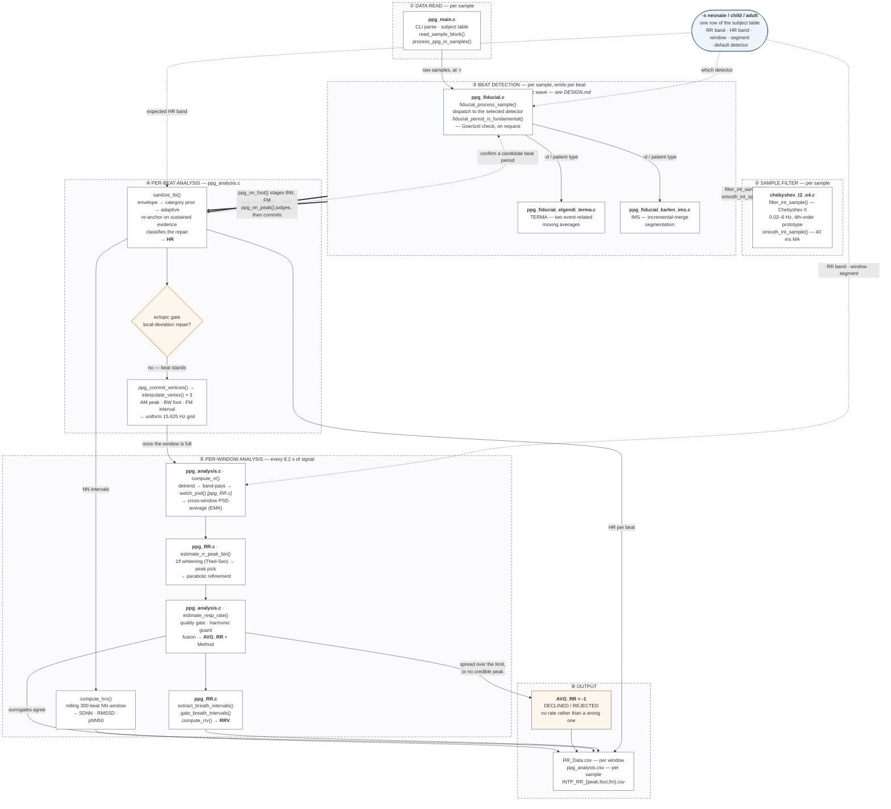
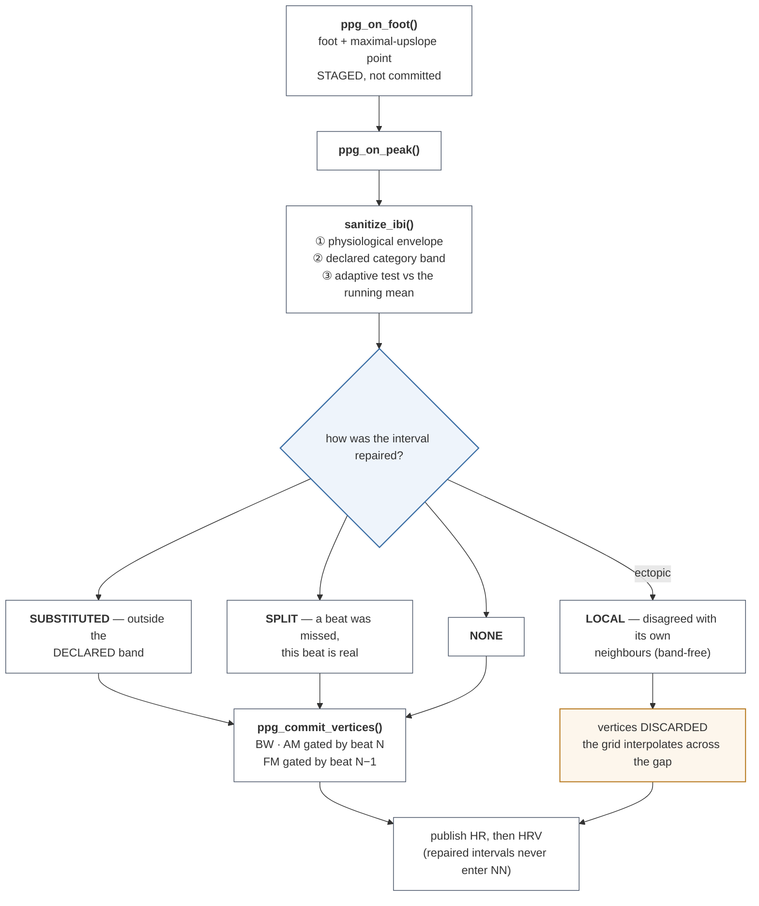
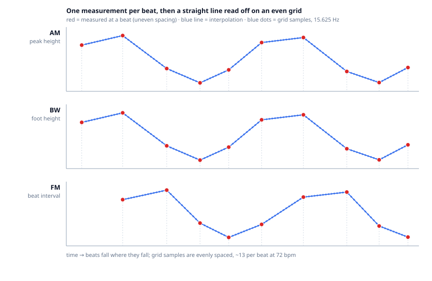

# Architecture

High-level view of the modules and how a sample travels through them.

Detail on *why* each stage works the way it does is in `DESIGN.md`; measured
performance is in `RESULTS.md`; the replaceable-detector contract is in
`FIDUCIAL_INTERFACE.md`. This file is the map, not the argument.

> **Timing convention.** Every rate and duration here describes the *signal*:
> sample rates are the rate the signal was recorded or resampled at, and window
> lengths are seconds of recorded signal. Nothing here is execution time.

---

## Block diagram

Each dashed enclosure is a processing stage. Solid boxes are translation units.



**Reading the diagram.** Solid arrows carry data. Dotted arrows do not. They are
either **service calls that return to the caller** — the active detector asks the
filter to condition each sample, and `sanitize_ibi()` asks the detector layer to
confirm a candidate beat period — or **configuration**, which is the blue node.

**The two rates are the reason for the grouping.** Stages ①–④ run *per sample or
per beat*. Stage ⑤ runs once per analysis window, every 8.2 s of signal. HRV is
computed there, not on the beat path, because it needs a window of intervals.

Only one detector runs in a given session, so the filter call and the beat
callbacks are drawn **once** from the detection stage rather than once per
detector.

**The blue node is the patient-type knob, and it is the reason there is one
binary.** `-s` selects one row of `g_subject[]` in `ppg_main.c`, and that row is
handed down as *data* to the stages that need it: which detector to dispatch,
the heart-rate band to sanity-check against, and the respiratory band, analysis
window, Welch segment and slide.

**No stage below `ppg_main.c` branches on the category** — each receives numbers
and works from them, so none contains a neonate/child/adult decision. (The
detector does carry constants named `TERMA_W*_ADULT_MS`; those are Elgendi's
published values, named for the cohort *he* measured them on, and the detector
rescales them from the heart-rate band it is handed.) Adding a category, or
reading the selection from a device setting instead of a command line, is an edit
to that one table.

**The amber node is the decline path, and it is a deliberate output, not a
failure.** When the three surrogates disagree by more than the allowed spread, or
no credible spectral peak exists, the window reports `AVG_RR = -1` rather than a
number the data does not support. That spread is 4 /min for adults, and scales
with the band width for the other patient types. It is drawn because a reader who sees only the path to
`RR_Data.csv` would assume every window yields a rate; roughly one adult window
in ten does not, by design.

---

## What happens to one beat

Every beat passes through the same sequence, and the order is load-bearing:
the interval is judged *before* its vertices are committed, and the vertices are
committed *before* the heart rate is published. Reversing either is silent and
invisible in the respiratory output.



**Only the LOCAL class is treated as ectopic.** It is the one the sources
describe — a deviation from the interval's own neighbours. The band class is a
statement about the *declaration* rather than the beat, and gating on it was
measured to cost respiratory accuracy on the annotated adults; the split class
is a real beat whose interval was reconstructed. See `DESIGN.md`, "Ectopic beats
do not reach the respiratory surrogates".

**Three orderings that must not be swapped**, all silent if they are:

| | why |
|:---|:---|
| foot staged, not committed | the beat it belongs to has not been judged yet |
| commit before HR/HRV publish | committing after shifts every row one beat fresher, and no respiratory figure moves to show it |
| FM gated by beat N−1 | the FM vertex staged at foot N describes the cycle *before* it |

## The sampling rate changes three times

This is the single most useful thing to hold in mind when reading the code.

| stage | rate | why |
|:---|:---|:---|
| ① → ③ sample path | **125 Hz** (`-r`) | the recording's own rate |
| ③ → ④ beat events | **irregular**, ~0.7–3 Hz | one event per cardiac cycle; 43–181 bpm across the supported bands |
| ④ → ⑤ surrogate grid | **15.625 Hz** | `RR_INTP_GRID_HZ`. The rate is the target; the decimation is derived from `-r` — see below |

The surrogates are **beat-sampled** before interpolation, so their Nyquist limit
is HR/2 — which is why the reportable respiratory band has a per-patient ceiling
rather than a constant one.

---

## Why the values are put on an even grid

Each heartbeat gives one measurement of each surrogate.

The FFT needs samples that are evenly spaced in time. Beats are not evenly
spaced. The gap between one beat and the next keeps changing.

So the values are interpolated onto an even grid first. A straight line is drawn
between two beat measurements. Values are read off that line at even intervals.
The spacing is now even, and the FFT can be used.

There is a second reason, and it is the stronger one. **Breathing itself changes
the gap between beats.** That is what the FM surrogate measures. So the uneven
spacing is not random noise that would average out. It follows the same rhythm we
are trying to find. Left alone, the timing error corrupts the measurement it sits
inside.

**Detrending is a different step, and it comes later.** It removes slow drift so
the breathing peak stands out in the spectrum. It does not change the spacing.
The order is: interpolate, smooth, detrend, band-pass, then the spectrum.

## How the interpolation works

Each beat gives one measurement. A straight line joins each pair of consecutive
measurements. The line is read off at even intervals to give the grid samples.

All three surrogates work the same way. Only the quantity measured is different.



Read it as three panels sharing one time axis:

- **Red circles are the real measurements.** One per beat. A dashed line drops
  each to the time axis, so the uneven beat spacing is easy to see. Nothing else
  in the figure was measured.
- **The blue line is the interpolation.** The blue dots are the grid samples
  taken from it. They are evenly spaced, 15.625 Hz, about 13 per beat at 72 bpm.
  Each dot sits on the line. None is held at the previous value.
- **The slow rise and fall is the breathing.** That is what the spectrum looks
  for.

Every grid point is computed **directly from the two beats bracketing it**, never
accumulated from the previous grid point:

```
    v = v0 + (v1 - v0) * (t - t0) / (t1 - t0)
```

A 5-tap moving average is then run over the grid series. That is what the Welch
PSD reads. It is the `*_Mvg` column of `INTP_RR_{peak,foot,fm}.csv`.

### The grid rate is constant; the decimation is derived from `-r`

The target is `RR_INTP_GRID_HZ`, 15.625 Hz — one grid sample every 64 ms. The
decimation is worked out from the input rate:

```
    decimation = round(fs / 15.625)        grid rate = fs / decimation
```

The decimation has to be a whole number of raw samples. So the interval is
exactly 64 ms only when `fs` is a multiple of 15.625 Hz — 125, 250, 500 and
1000 Hz all give exactly 64.00 ms. Other rates land close but not on it: 100 Hz
gives 60.00 ms, and 367 Hz gives 62.67 ms.

Fixing the *rate* rather than the decimation is what keeps the analysis window a
constant **duration**. Hold the decimation constant instead and the window shrinks as the
input rate rises, so the respiratory estimate would change with the recording
hardware rather than with the patient. The resolved grid rate is printed at
start-up. The measurement behind the choice is in [`DESIGN.md`](DESIGN.md), "The
surrogate grid rate is derived from fs".

**Three consequences, each of which shows up elsewhere:**

- **A surrogate carries information only up to half the beat rate.** It gains one
  new value per cardiac cycle, so its Nyquist limit is HR/2 — a property of the
  sampling, not of the estimator, and the reason the reportable respiratory band
  has a per-patient ceiling.
- **Interpolation invents nothing.** Between two beats there is no measurement,
  only a straight line. A respiratory feature shorter than a beat interval cannot
  be recovered, however dense the grid is made.
- **The three do not advance together.** AM is written when a peak arrives, BW
  when a foot arrives, FM only once an interval closes. The grid buffers are
  deliberately **twice** the analysis window so the surplus can be held until all
  three cover the same span of time.

Interpolating between the bracketing pair rather than accumulating a per-step
increment is a deliberate correction; the measurement that forced it is in
[`DESIGN.md`](DESIGN.md).

*The figure is generated, not drawn: `docs/img/interpolation.svg` is plain SVG
with the geometry computed, so every grid sample lies exactly on its segment.*

---

## Modules

| file | stage | responsibility |
|:---|:---:|:---|
| `src/ppg_main.c` | ① ⑥ | command line, the subject-type table, block read, CSV headers |
| `src/chebyshev_t2_o4.c` | ② | band-pass and smoothing of the raw sample stream |
| `src/ppg_fiducial.c` | ③ | detector dispatch; the Goertzel fundamental check |
| `src/ppg_fiducial_elgendi_terma.c` | ③ | TERMA detector (default for child/adult) |
| `src/ppg_fiducial_karlen_ims.c` | ③ | IMS detector (default for neonate) |
| `src/ppg_analysis.c` | ④ ⑤ | interval sanitising and repair classification, the ectopic gate, HR, the three surrogates, fusion, HRV |
| `src/ppg_RR.c` | ⑤ | Welch PSD, peak estimation, breath intervals, RRV |
| `include/ppg_common.h` | — | the analysis context and every tunable, each cited |
| `include/filter_bands.h` | — | per-subject bands and the plausibility envelope, each cited |
| `include/ppg_fiducial.h` | — | the detector contract |

---

## Two boundaries that matter

**The detector is replaceable.** A detector reports beats to the analysis layer
through `ppg_on_foot()` and `ppg_on_peak()`, and nothing else. To add one:
implement a **prefixed pair**, as `ppg_fiducial_elgendi_terma.c` does with
`terma_fiducial_init()` and `terma_fiducial_process_sample()`; declare them in
`ppg_fiducial.h`, and add a row to the dispatch table in `ppg_fiducial.c`. Nothing else in the tree changes.
(The unprefixed `fiducial_init()` / `fiducial_process_sample()` are the
dispatcher's own entry points, which the rest of the program calls; a detector
does not implement those.)

Both detectors are always linked, and the choice is made at run time because
which one is better depends on the patient. One call goes the other way:
`sanitize_ibi()` asks the detector layer to confirm a candidate beat period
through `fiducial_period_is_fundamental()`. See `FIDUCIAL_INTERFACE.md`.

**The subject type is resolved once.** `ppg_main.c` picks a row from its subject
table and hands it to `ppg_analysis_init()` and `fiducial_init()` as data. Below
that line no stage branches on the category — each receives numbers and works
from them. Reading the category from a device setting instead of `-s` is a change
to that one block.
