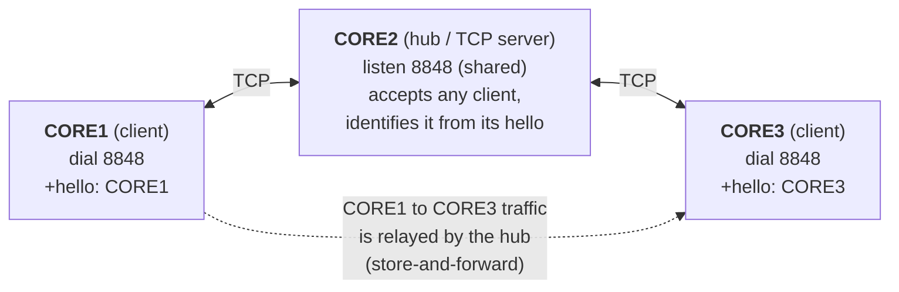
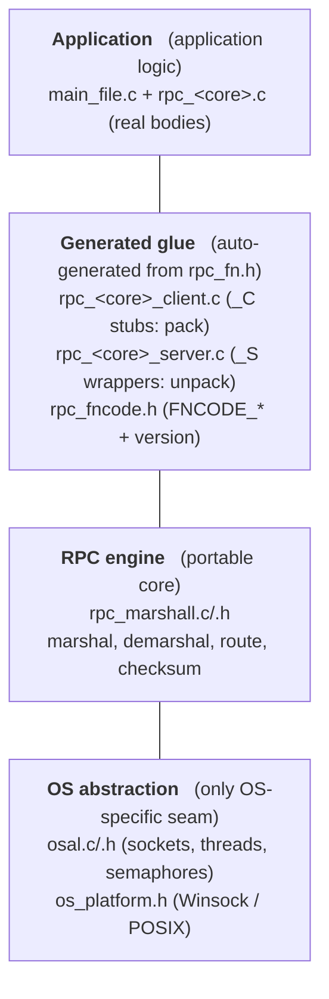
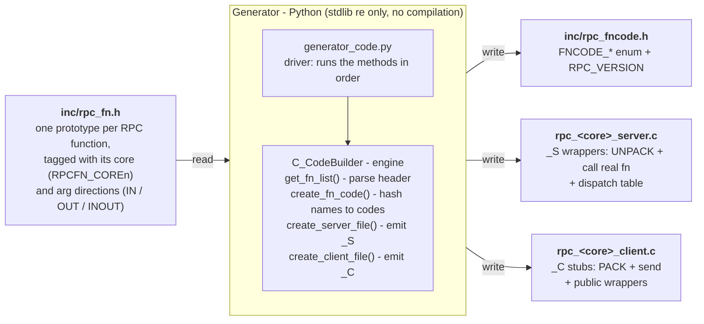
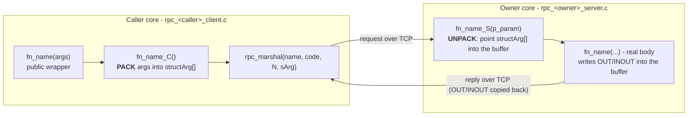
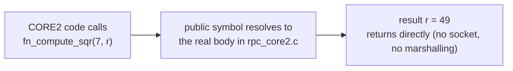
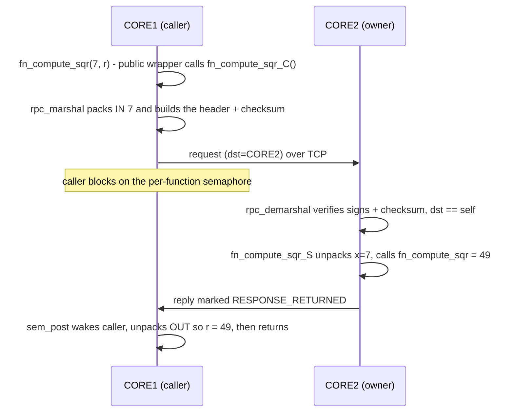
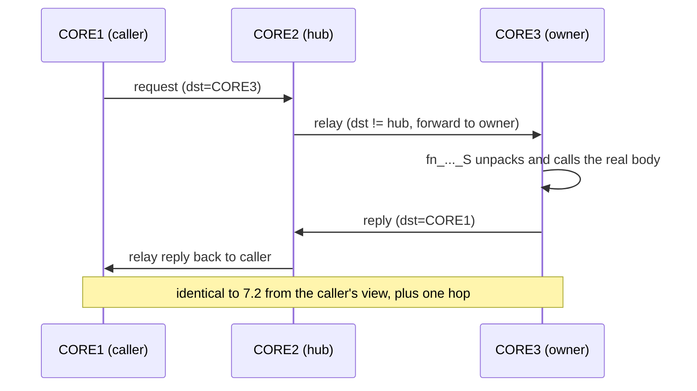
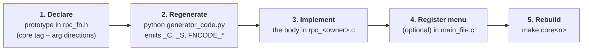

# RPC Framework — Technical Guide

This document describes the internal design of the framework: the architecture,
the code generator, the `_C`/`_S` stubs, the dispatch table, the
marshal/demarshal engine, argument directions, the two call paths (a
**self-defined** local call and an **other-core** remote or relayed call), and the
procedure for adding a new function. Operational instructions are given in
**USER_GUIDE.md**; the Android implementation is documented in
**ANDROID_GUIDE.md**.

---

## Overview

The framework has a single purpose: to make a function that runs on one core
callable from another core using ordinary call syntax. Three mechanisms achieve
this, and the numbered sections detail each in turn:

1. **A code generator** (§2). From one declaration of a function in `rpc_fn.h` it
   produces the plumbing for every core: a *client stub* (`_C`) that packs and
   sends a call, and a *server wrapper* (`_S`) that receives it and runs the real
   function (§3).
2. **A dispatch table** (§4). On each core, this table maps every function either
   to its local `_S` wrapper (if this core owns the function) or to the id of the
   core that does own it (used for routing).
3. **A marshalling engine over TCP** (§5, §6). It serializes arguments, sends the
   packet, and deserializes the reply. One core acts as the hub (§1) and relays
   traffic between the other two.

From this, a call takes one of two paths (§7): if the calling core owns the
function, the call runs locally like any normal function; otherwise the arguments
are packed and sent to the owning core — directly, or relayed through the hub —
executed there, and the result is returned to the caller.

**How to read this guide.** §1 describes the architecture (cores, layers, files).
§2–§4 describe the generated code and how a call is routed. §5–§6 describe the wire
engine and the argument rules. §7 traces a call from start to finish. §8 is the
step-by-step procedure to add a function, and §9 lists platform notes and known
limitations. A reader wanting only the mental model can stop after this overview
and §7.

---

## 1. Architecture

### 1.1 Topology
One core is the **hub (TCP server)**, which binds and listens; the other two are
**clients** that connect to it. There is no direct client-to-client link; the hub
relays such traffic.


The hub assignment is configurable (`-S` / `$RPC_SERVER_CORE` / `setServerCore()`) and
defaults to CORE2. **All cores use one shared port, `8848`**: the hub listens on that
single port for every client, and each client dials the same port. Because the port no
longer identifies the caller, each client sends a tiny **handshake** — its own core id as
a 4-byte value — immediately after connecting, and the hub reads it right after `accept()`
to place the socket in the correct core slot (§5).

### 1.2 Software layers (identical on every core; only the generated tables differ)
Each core is built as four layers; a call travels down through them and the
received bytes travel back up:



### 1.3 File map

The repository is organised into directories: headers in **`inc/`**, C sources in
**`src/rpc_src/`**, the Python generator in **`src/python_scripts/`**, and the
Android projects in **`src/android_projects/`**. The Makefile compiles from these
locations and passes `-Iinc` for the headers. Filenames below are given as bare
names for brevity; the **Path** column shows where each lives.

| File | Path | Kind | Description |
|------|------|------|-------------|
| `rpc_fn.h` | `inc/` | hand-written | **input**: prototypes with tags and directions |
| `C_Code_Generator.py` | `src/python_scripts/` | hand-written | generator engine (`C_CodeBuilder`) |
| `generator_code.py` | `src/python_scripts/` | hand-written | driver that runs the generator |
| `rpc_fncode.h` | `inc/` | **generated** | `FNCODE_*` enum and `RPC_VERSION` |
| `rpc_<core>_client.c` | `src/rpc_src/` | **generated** | `_C` stubs used to *call* remote functions |
| `rpc_<core>_server.c` | `src/rpc_src/` | **generated** | `_S` wrappers and dispatch table for *this* core |
| `rpc_<core>.c` | `src/rpc_src/` | hand-written | the **implementations** of that core's functions |
| `rpc_marshall.c` / `.h` | `src/rpc_src/` · `inc/` | framework | pack / send / receive / route / unpack |
| `osal.c` / `.h`, `os_platform.h` | `src/rpc_src/` · `inc/` | framework | OS abstraction; Windows vs POSIX headers |
| `main_file.c` | `src/rpc_src/` | hand-written | startup and interactive `rpc>` prompt |

---

## 2. Code Generator

The generator is a pure text generator: it parses the prototypes in `rpc_fn.h` and
emits C source strings. It performs no compilation and depends only on the Python
standard library (`re`). It comprises two files:

- **`generator_code.py`** — the **driver**. It fixes the input file name, creates one
  `C_CodeBuilder` instance, and calls the engine methods in order.
- **`C_Code_Generator.py`** — the **engine**, defined as the class `C_CodeBuilder`.
  All parsing and emission logic resides here.

**The generator at a glance — one input, three kinds of output:**



The hand-written prototypes in `rpc_fn.h` are the input; the driver invokes each
engine method in order; the outputs are the shared code header (`rpc_fncode.h`),
the per-core **server** file (`_S` wrappers that receive calls), and the per-core
**client** file (`_C` stubs that issue calls). The subsections below specify each
method.

### 2.1 The driver (`generator_code.py`)
The driver executes the following sequence:

```python
code_obj = C_CodeBuilder()
code_obj.get_fn_list('rpc_fn.h')          # parse the header
code_obj.create_fn_code('rpc_fncode.h', 'rpc_fn.h')
for core in (core1, core2, core3):        # only if that core owns ≥ 1 function
    code_obj.create_server_file(core)     # rpc_<core>_server.c
    code_obj.create_client_file(core)     # rpc_<core>_client.c
```

A core's server and client files are generated only when that core owns at least one
function (`len(coreN_fn_list) != 0`). Every generated file is written into the
current directory, overwriting any previous version.

### 2.2 Parsing the header (`get_fn_list`)
This first pass reads `rpc_fn.h` and records, per core, which functions that core
owns and each function's full prototype. These internal tables are the raw material
every later step consumes. The engine reads the file line by line and builds:

- **Core tags.** Lines of the form `#define RPCFN_COREn` are collected into the
  `Cores` list. Once all three tags are known, each subsequent prototype line is
  matched against them.
- **Per-core function lists.** A prototype containing `Cores[0]` is appended to
  `core1_fn_list`, one containing `Cores[1]` to `core2_fn_list`, and one containing
  `Cores[2]` to `core3_fn_list`. The leading core tag is stripped (`split(' ', 1)[1]`),
  so each stored entry is the prototype from the return type onward, e.g.
  `enumRpcErr  fn_compute_mod (int x, IN int y, OUT int *pmod);`.
- **Ownership map.** `fn_native[prototype] = 'rpc_coreN'` records the owning core for
  each prototype, and `TotalNoFn` is incremented.

After parsing, `find_hashprime(TotalNoFn)` sets the hash size and the `fn_hashtable`
list is sized to `HASHPRIME`.

### 2.3 Function codes and the hash table

Every function needs a **function code**: a small integer that identifies it. The
code serves two purposes — it is emitted as the `FNCODE_*` constant the `_C` stub
passes when sending a call, and it is the **index of the function's slot in the
dispatch table** (§4). Because the code *is* the slot index, the receiving core
finds the target function with a single array lookup rather than by comparing
strings.

**Why derive the code from a hash of the name, instead of numbering functions
1, 2, 3… in declaration order?** Two reasons:

- **Stability.** A hash of the name does not depend on where the function sits in
  `rpc_fn.h`. Editing a function's arguments, or reordering declarations, leaves
  every other function's code unchanged. Sequential numbering would instead shift
  the code of everything after an inserted or removed line.
- **Agreement without coordination.** Each core's files are generated independently,
  yet all cores compute the same code for a given name because they run the identical
  hash over the identical name — no shared registry or manual id assignment is
  needed. (On receipt, dispatch re-hashes the name carried in the packet via
  `get_hash_index()`, so the lookup is ultimately driven by the name itself.)

Three methods build the table:

- **`find_hashprime(n)`** chooses the table size: the first prime greater than `2n`
  (for 9 functions, `HASHPRIME = 19`). Two design choices matter here — a **prime**
  modulus spreads the simple XOR hash more evenly, and sizing the table to **more
  than twice** the function count keeps it under ~50% full, so collisions are rare
  and probing stays short. This value becomes `FNCODE_HASHPRIME` and the length of
  the dispatch table.
- **`hash_function(s)`** computes a slot from a string: it XOR-combines the character
  codes of `s` and takes the result `mod HASHPRIME`. The string hashed is the
  server-wrapper name, `"<name>_S"` (for example `"fn_compute_sqr_S"`).
- **`update_hashtable(idx, name, code)`** places the entry. If the computed slot is
  already occupied (a **collision**), it advances to the next slot, wrapping around
  at `HASHPRIME` — this is **linear probing**. The slot the entry finally lands in
  becomes that function's numeric code.

So the code is derived from the **name**: changing a function's arguments never
renumbers any function, and because every core runs the same procedure over the same
names, all cores agree on the numbering.

### 2.4 Generating `rpc_fncode.h` (`create_fn_code`)
This method writes the shared header:

1. The auto-generated banner (`fHeader_Comment`).
2. A fixed preamble (`fn_code_write`): the include guard, `#include "rpc_fn.h"`,
   `#define RPC_VERSION 0x0001`, the `enumArgDir` enum (`RPCARG_IN/OUT/INOUT/MAX`),
   the `enumFnCore` enum (`RPCCORE_CORE1..3`, `RPCCORE_COUNT`), and the opening of the
   `enumRpcFnCode` enum.
3. One `FNCODE_<NAME> = <idx>` entry per function, iterating CORE1 then CORE2 then
   CORE3. For each, the bare name is extracted from the prototype, hashed as
   `"<name>_S"`, placed with `update_hashtable`, and recorded in `enumRpcFnCode`.
4. A trailing `FNCODE_HASHPRIME = <HASHPRIME>` member, then the enum and guard are
   closed.

### 2.5 Generating the server file — `_S` stubs (`create_server_file`)
For a given core, this method writes `rpc_<core>_server.c`: the banner, the includes
(`rpc_fncode.h`, `rpc_marshall.h`), one `_S` wrapper per **native** function, and then
`get_this_core()`, `fn_table_init()`, and `get_hash_index()`.

Each `_S` wrapper is produced by **`server_create_SFunction`** and
**`server_get_params_struct`**:

- A function whose only parameter is `void` is emitted as a direct call with no
  argument unpacking.
- Otherwise the wrapper declares `structArg sArg[N]` and a byte cursor
  `p_data = p_param`. For each parameter, in order, it emits:
  - `e_arg_type` — from the direction tag (`IN`→`RPCARG_IN`, etc.). A parameter with
    no explicit tag defaults to `IN`.
  - `arg_len` — `strlen(p_data)+1` for a string, `sizeof(size_type)` for an
    `RPCARR_SIZE` scalar, `(*sArg[i-1].p_arg) * sizeof(element)` for an
    `RPC_TYPE_ARRAY` (the count comes from the preceding size argument), and
    `sizeof(type)` otherwise.
  - `p_arg = p_data`, after which `p_data` is advanced by `arg_len`, so successive
    arguments are read sequentially from the received buffer.
- It then builds the call to the real implementation, dereferencing each entry
  according to its kind (scalars are dereferenced, arrays and pointers are cast).

`fn_table_init` (**`server_fn_table_init`**) writes the dispatch table: an
`INIT_FN_TABLE(...)` line with a real `_S` pointer for each native function, followed
by one with a `NULL` pointer for every function owned by the other two cores. The
final field is `has_out`, computed by `get_fn_details` by scanning the parameters for
the substring `OUT` — note that `INOUT` also matches, so any output argument marks the
function as blocking.

### 2.6 Generating the client file — `_C` stubs (`create_client_file`)
For a given core, this method writes `rpc_<core>_client.c` containing, for every
function owned by the **other** two cores, a `_C` stub and a public wrapper.

- **`client_C_fn_create`** emits the `static <ret> fn_<name>_C(<params>)` signature
  (a `void`-parameter function marshals with zero arguments and a `NULL` buffer).
- **`client_get_params_struct`** fills `structArg sArg[N]` from the caller's local
  variables — mirroring §2.5 but reading *from* the arguments rather than a buffer —
  and closes the stub with
  `rpc_marshal("<name>_S", FNCODE_<NAME>, <N>, &sArg[0]); return eRpcErr;`.
- The public wrapper is the original prototype (with the trailing `;` removed) whose
  body simply forwards to `fn_<name>_C(...)`.

> The generator does not write `rpc_<core>.c`; those files hold the hand-written
> implementations. `RPC_VERSION` is emitted as a fixed `0x0001` and does not
> auto-increment when a signature changes (see the §9 caveat).

---

## 3. Client and Server Stubs (`_C` / `_S`)

In short: for each function the generator emits two helpers — one that *makes* the
call and one that *receives* it. This section describes both.

Every function exists in two generated forms:

- **`fn_..._C`** (client stub), located in the *caller's* `rpc_<core>_client.c`. It
  **packs** the arguments into `structArg[]` and calls `rpc_marshal()`. A public
  wrapper bearing the real name calls the `_C` stub.
- **`fn_..._S`** (server wrapper), located in the *owner's* `rpc_<core>_server.c`. It
  **unpacks** the arguments from the received buffer and calls the implementation.

### What `_C` and `_S` are, and when each is called

The suffix identifies which side the function belongs to and when it executes:

- **`fn_<name>_C` — the client stub** (`C` = **C**lient / caller side).
  - *Function:* serializes the call's arguments into `structArg[]` according to each
    argument's direction and passes them to `rpc_marshal()`.
  - *Invocation:* executes on the **caller** core whenever application code calls
    the public `fn_<name>(...)`. On a core that does **not** own the function, the
    public symbol is a wrapper whose body calls `fn_<name>_C(...)`; the call thus
    resolves to the `_C` stub. It executes in the calling thread and, if the
    function declares any `OUT`/`INOUT` argument, blocks until the reply is
    received (§5).

- **`fn_<name>_S` — the server wrapper** (`S` = **S**erver / owner side).
  - *Function:* accepts one `void *p_param` (the received argument bytes),
    deserializes them (points `structArg[]` into the buffer), and invokes the real
    implementation.
  - *Invocation:* executes on the **owner** core, driven by the RPC receive thread;
    it is not called by application code. On receipt of a request packet,
    `rpc_demarshal()` reads its function code, looks up the corresponding `_S`
    pointer in the dispatch table (`rpc_fn_table`), and invokes it with the packed
    buffer (§4, §5).

> On the owning core the function has **no** `_C` stub (its client file omits it);
> a local call binds directly to the real implementation (§7.0). Only the owner
> compiles the `_S` wrapper.

**The two directions** (`_C` serializes and sends; `_S` receives and deserializes):



The two code listings below are the exact forms the generator emits for
`fn_compute_mod` (packing on CORE2, unpacking on CORE1).

### Generated `_C` Stub
```c
/* rpc_core2_client.c — CORE2 calling CORE1's fn_compute_mod */
static enumRpcErr fn_compute_mod_C (int x, int y, int *pmod)
{
    structArg  sArg[3];
    sArg[0].e_arg_type = RPCARG_IN;   sArg[0].arg_len = sizeof(x);   sArg[0].p_arg = (unsigned int*)&x;
    sArg[1].e_arg_type = RPCARG_IN;   sArg[1].arg_len = sizeof(y);   sArg[1].p_arg = (unsigned int*)&y;
    sArg[2].e_arg_type = RPCARG_OUT;  sArg[2].arg_len = sizeof(int); sArg[2].p_arg = (unsigned int*)pmod;
    return rpc_marshal("fn_compute_mod_S", FNCODE_FN_COMPUTE_MOD, 3, &sArg[0]);
}
```

### Generated `_S` Wrapper
```c
/* rpc_core1_server.c — CORE1 receiving fn_compute_mod */
enumRpcErr fn_compute_mod_S (void *p_param)
{
    structArg      sArg[3];
    unsigned char *p_data = (unsigned char *)p_param;   /* packed arg bytes */
    sArg[0].e_arg_type = RPCARG_IN;  sArg[0].arg_len = sizeof(int); sArg[0].p_arg = (unsigned int*)p_data; p_data += sArg[0].arg_len;
    sArg[1].e_arg_type = RPCARG_IN;  sArg[1].arg_len = sizeof(int); sArg[1].p_arg = (unsigned int*)p_data; p_data += sArg[1].arg_len;
    sArg[2].e_arg_type = RPCARG_OUT; sArg[2].arg_len = sizeof(int); sArg[2].p_arg = (unsigned int*)p_data; p_data += sArg[2].arg_len;
    /* invoke the implementation, reading and writing directly in the buffer */
    return fn_compute_mod(*(int*)sArg[0].p_arg, *(int*)sArg[1].p_arg, (int*)sArg[2].p_arg);
}
```
The `_S` wrapper points its `structArg` entries **into the received buffer**, so
when the implementation writes through the `OUT` pointer, the result already
resides in the buffer that is returned.

---

## 4. Dispatch Table

In short: when a core receives a message, this table tells it either which local
function to run or which core to forward the message to.

Each core holds one table, `rpc_fn_table[FNCODE_HASHPRIME]`, populated by
`fn_table_init()`. Every core lists **all** functions:
- functions native to this core → a valid `_S` pointer;
- functions owned by another core → `NULL` plus the owning core's ID (routing
  information).

```c
/* rpc_core1_server.c */
INIT_FN_TABLE("fn_compute_mod_S", FNCODE_FN_COMPUTE_MOD, fn_compute_mod_S, RPCCORE_CORE1, 1); /* served here */
INIT_FN_TABLE("fn_compute_sqr_S", FNCODE_FN_COMPUTE_SQR, NULL,             RPCCORE_CORE2, 1); /* route to CORE2 */
```
The final argument (`1`/`0`) indicates whether the function has an `OUT`/`INOUT`
result. A **semaphore** and **mutex** are created for an entry only when this flag is
`1` **and** the pointer is `NULL` (a function owned by another core) — that is, an
entry this core will call remotely and block on for the reply. Native entries (a real
`_S` pointer) are served locally and receive neither. `rpc_marshal` uses the presence
of this semaphore to decide between the blocking and fire-and-forget paths (§5).

---

## 5. Marshalling Engine (`rpc_marshall.c`, identical on every core)

In short: this is the code that actually sends and receives packets. It has two
halves — a **send side** (`rpc_marshal`) that packs arguments and transmits, and a
**receive side** (`rpc_demarshal`) that runs in a background thread, validates each
incoming packet, and either dispatches it, relays it, or wakes a waiting caller.

**`rpc_marshal(name, code, arg_count, sArg[])`** — send side:
1. Compute the size as header + Σ`arg_len`; allocate the buffer; populate the header
   (signs, version, source/destination, checksum).
2. `rpc_pack_arguments()` copies `IN`/`INOUT` arguments into the buffer; `OUT`
   arguments are left zeroed, as there is nothing to transmit for them.
3. If the function has an `OUT`/`INOUT` result, transmit the packet and **block on
   the semaphore**. When the reply arrives, `rpc_unpack_arguments()` copies the
   `OUT`/`INOUT` values back into the caller's variables.
4. Otherwise, transmit the packet and return (fire-and-forget).

**`rpc_demarshal(buf, size)`** — receive side, executed in a receive thread:
1. Validate the start/end signs and checksum; discard on failure.
2. On `"__members__"`, adopt the bitmap and discard.
3. If the destination is not this core, **relay** the packet to the correct core
   (the hub's responsibility).
4. On a returned reply, post the semaphore to wake the waiting caller.
5. Otherwise, for an incoming request, call the function's `_S` wrapper and, if a
   reply is expected, transmit the result back to the original source.

Threading: `rpc_init()` starts one receive thread per link — the hub opens one per
client, and a client opens one toward the hub. Each thread calls `open_comm()` on
its socket, then loops over `os_recv_rpc_buffer()` → `rpc_demarshal()`.

Single-port connection setup: the hub binds and listens **once** on the shared port
(`os_server_listen_init()`), then its per-client threads all `accept()` on that same
listen socket. Since `accept()` gives no hint of who connected, each accepted socket is
identified by the client's handshake: `socket_client_init()` sends the client's core id
right after `connect()`, and `socket_server_init()` reads it right after `accept()`,
storing the data socket in `sSocketInfo[that_core]`. The core passed to a hub receive
thread is therefore only a hint for thread count — whichever thread wins a given
connection services whichever core the handshake reveals.

---

## 6. Argument Handling and Directions

In short: an argument's **direction tag** (`IN`, `OUT`, `INOUT`) decides whether it
is sent to the callee, returned to the caller, or both. This section defines those
rules and how variable-length arrays and strings are measured.

Each argument is described by a `structArg { e_arg_type, arg_len, p_arg }`. The
prototype tags direct the generator in populating it:

| Tag | Meaning | `arg_len` |
|-----|---------|-----------|
| `IN` | input, copied to the callee | `sizeof(type)` |
| `OUT` | output, copied back to the caller | `sizeof(type)` |
| `INOUT` | both directions | `sizeof(type)` |
| `RPCARR_SIZE` | this int is an array length | `sizeof(int)` |
| `RPC_TYPE_ARRAY` | variable-length array | `(preceding size value) * sizeof(element)` |

Engine behaviour:
- **pack** (`rpc_pack_arguments`): copies the bytes unless the argument is `OUT` or
  its pointer is `NULL`, in which case it zero-fills. Thus `IN` and `INOUT` are
  transmitted; `OUT` is not.
- **unpack** (`rpc_unpack_arguments`): copies bytes back unless the argument is `IN`.
  Thus `OUT` and `INOUT` are written back into the caller's variables.

Consequences:
- `IN int x` → the value travels in one direction only.
- `OUT int *p` → nothing is transmitted; the reply carries the value into `*p`.
- `INOUT T *p` → transmitted **and** returned (for example, an array echoed back, or
  a string rewritten by the callee). Any `OUT`/`INOUT` argument makes the call
  **blocking** (it waits for the reply).
- Array: the `RPCARR_SIZE` scalar is packed first; the array's `arg_len` is
  `size * sizeof(element)`, so exactly `size` elements travel. The size argument must
  immediately precede the array argument.
- String: a `char` array; pass `strlen+1` so the terminator travels. On the callee
  side, a buffer sized for the reply is required if the callee rewrites it.

> Omitting `OUT` on a result pointer prevents the value from being returned to the
> caller.

---

## 7. Call Paths

### 7.0 Interpretation — self-defined vs other-core
The caller always writes the **same** statement, `fn_compute_sqr(7, &r)`, with no
indication of where the function executes. The resolution of that name is
determined **at link time**, by which generated files each core compiles:

- **The owning core links the implementation.** For a function tagged `RPCFN_COREn`,
  the only definition of the public symbol on CORE*n* is the hand-written body in
  `rpc_<coren>.c`. That core's *client* file (`rpc_<coren>_client.c`) **omits the
  function entirely** — for example, `fn_compute_sqr` is absent from
  `rpc_core2_client.c`. On CORE2 the name therefore binds directly to the local
  body: an ordinary function call, with no socket and no marshalling (§7.1).
- **Every other core links a `_C` stub.** On the cores that do not own the function,
  the generator emits a public wrapper of the same name in `rpc_<core>_client.c`
  whose sole task is to pack the arguments and call `rpc_marshal()` (§7.2 / §7.3).

There is no runtime "is this core the owner?" test in the caller; the decision is
fixed by the generator and linker. The dispatch table's owner ID is used on the
*receive* side, for routing and relay, not by the caller. The remaining subsections
trace each path.

### 7.1 Self-defined (local) call — the caller owns the function
When a core calls a function it owns, no RPC occurs. The public name resolves
directly to the implementation in that core's `rpc_<core>.c`.



A `_C` stub for this function exists only in the other cores' client files; on the
owning core the public wrapper is the implementation itself. There is no socket, no
marshalling, and no waiting — an ordinary function call. On Android, CORE1 functions
such as `fn_compute_mod` execute locally in this manner and are therefore always
available, including when there is no network.

### 7.2 Other-core (remote) call — the owner is a different core
The public name resolves to a `_C` stub, which marshals the call to the owning
core over TCP and blocks until the reply returns:



The caller blocks on the per-function semaphore (matched by `fn_rpc_instance`) until
the reply posts it; the `OUT`/`INOUT` bytes are then copied back.

### 7.3 Relayed remote call — caller and owner are both clients
CORE1 and CORE3 have no direct link, so the hub forwards the traffic:


On the hub, `rpc_demarshal` observes `dst_core ≠ me`, copies the buffer into a
destination-core buffer, and re-sends it. The reply carries `dst = src_core` and is
relayed back by the same route. From the caller's perspective the behaviour is
identical to §7.2, with a longer blocking interval.

---

## 8. Adding a New Function

The prototype in `rpc_fn.h` is the **single source of truth**. Declaring the
function (tagged with the core that executes it), regenerating, and implementing the
body in that core's implementation file is sufficient. The generator produces the
remainder: the `_C` client stubs on the other cores, the `_S` server wrapper and
`INIT_FN_TABLE` entry on the owner, and the `FNCODE_*` enum. The following worked
example adds **`fn_multiply(a, b) → a*b`** on **CORE2**.

The procedure, end to end (step 2 runs the generator; steps 1, 3, 4 are
hand-written; step 5 builds):



The subsections below detail each step.

### Step 1 — declare the prototype in `rpc_fn.h`
The declaration has three parts: the **core tag** (the core that executes it), the
return type (`enumRpcErr`), and the argument list with **direction** markers.
```c
RPCFN_CORE2  enumRpcErr  fn_multiply (IN int a, IN int b, OUT int *pprod);
```

**Core tag — the core that owns (executes) the function:**

| Tag | Executes on | Implement the body in |
|-----|-------------|-----------------------|
| `RPCFN_CORE1` | CORE1 (the Android application) | `rpc_core1.c` |
| `RPCFN_CORE2` | CORE2 | `rpc_core2.c` |
| `RPCFN_CORE3` | CORE3 | `rpc_core3.c` |

**Argument markers** (empty macros that direct the generator's marshalling of each
argument; see §6):

| Parameter kind | Declaration | Notes |
|----------------|-------------|-------|
| input scalar / struct | `IN int x` · `IN sPoint p` | copied by value into the packet |
| output value | `OUT int *px` · `OUT sPoint *pp` | must be a pointer; populated on return |
| input and output | `INOUT int *px` | transmitted, then overwritten with the result |
| array | `IN RPCARR_SIZE int n, IN RPC_TYPE_ARRAY int *arr` | the `RPCARR_SIZE` argument must immediately precede the `RPC_TYPE_ARRAY` argument; its value determines the element count transmitted |
| output array | `IN RPCARR_SIZE int n, OUT RPC_TYPE_ARRAY int *arr` | the caller allocates `n`; the size argument remains `IN` |
| string | `IN RPCARR_SIZE int len, IN RPC_TYPE_ARRAY char *str` | a `char` array; pass `strlen+1` as the size |

Structures must be plain, fixed-size, and free of pointers, as they are copied onto
the wire with `memcpy`; `sPoint {int x, y;}` is the reference example. Every function
returns `enumRpcErr`.

### Step 2 — regenerate the stubs
```
python src/python_scripts/generator_code.py   # reads inc/rpc_fn.h and regenerates ALL generated files
```
From that single declaration, the following files are regenerated and must not be
edited manually:
- `rpc_fncode.h` — adds `FNCODE_FN_MULTIPLY` and re-emits `RPC_VERSION`.
- `rpc_core2_server.c` — the `fn_multiply_S` unpack wrapper and its
  `INIT_FN_TABLE(..., fn_multiply_S, RPCCORE_CORE2, 1)` entry, so CORE2 dispatches to
  the implementation.
- `rpc_core1_client.c` / `rpc_core3_client.c` — the `fn_multiply` `_C` stub and
  public wrapper, so CORE1/CORE3 can call it remotely. CORE2's own client file does
  not contain the function; CORE2 calls its local body directly (§7.0).

### Step 3 — implement the body in the owner's implementation file
In `rpc_core2.c` (standard C, since the `IN`/`OUT`/`RPCFN_*` markers are empty
macros):
```c
enumRpcErr  fn_multiply (int a, int b, int *pprod)
{
    *pprod = a * b;
    printf("[CORE2] fn_multiply: %d * %d = %d\n", a, b, *pprod);
    return RPCERR_SUCCESS;
}
```
The `_S` wrapper points its `structArg` entries **into the received buffer**, so
writing `*pprod` places the result directly in the buffer that is returned (§3, §5).
For an array function, use the size argument as the loop bound.

### Step 4 — register the command in the `rpc>` menu (optional)
`main_file.c` contains a **menu table** (`g_menu[]`, whose fourth field is the owning
core, displayed as `[COREn]`) and a **dispatch switch**:
```c
{ "mul", "mul <a> <b>", "fn_multiply           -> a*b", RPCCORE_CORE2 },
...
else if (0 == strcmp(cmd, "mul")) {
    int a, b, r = 0;
    if (2 == sscanf(line, "%*s %d %d", &a, &b)) {
        fn_multiply(a, b, &r);              /* local on CORE2, otherwise RPC */
        printf("  fn_multiply(%d, %d) = %d\n", a, b, r);
    } else printf("  usage: mul <a> <b>\n");
}
```
`fn_multiply(...)` is invoked identically on every core; §7.0 determines whether the
call is local or remote.

### Step 5 — rebuild
**Desktop cores** (built on the machine that runs each):
```
python src/python_scripts/generator_code.py   # if not already regenerated in Step 2
make core2                    # or make core3 / make core1 — the Makefile selects -pthread / -lws2_32
```
`make core1` additionally builds CORE1 as a native process, so all three cores can
be exercised on a single machine over loopback (see USER_GUIDE.md §1b).

**CORE1 (the Android application)** carries its own copy of the generated code. When
the function set changes, copy the regenerated `rpc_fncode.h`, `rpc_core1_client.c`,
and `rpc_core1_server.c` into `aidlserver/jni/`. If the phone must call or serve the
function through the UI, additionally add the AIDL method, a JNI wrapper in
`jni/hello.c`, the binder method in `rpcserverservice.java`, and a spinner entry in
`rpcclient2`, then rebuild with Gradle. Additions confined to CORE2 and CORE3 require
no Android change. See **ANDROID_GUIDE.md**.

### Step 6 — run and invoke the function
Start the hub first, then the clients. At any client prompt:
```
rpc> mul 6 7
  fn_multiply(6, 7) = 42
```
The CORE2 terminal prints `[CORE2] fn_multiply: 6 * 7 = 42`, confirming that
execution occurred on CORE2 and the result was returned to the caller.

> Every participant must be regenerated from the **same** `rpc_fn.h`. A peer built
> from a stale header marshals the previous layout; because `RPC_VERSION` is fixed at
> `0x0001` (§9) the version check does not detect this, so all cores must be rebuilt
> together.

---

## 9. Cross-Platform Notes, Limitations, and Caveats

**Cross-platform support.** `os_platform.h` selects Winsock on Windows and BSD
sockets with pthreads on Linux/Android. `os_net_init()` performs `WSAStartup` on
Windows (a no-op elsewhere). The `Makefile` links `-lws2_32` on Windows and
`-pthread` on Linux; Android compiles the same C via the NDK `ndk-build`, with
`printf` routed to logcat.

**Known limitations and caveats:**
- **`RPC_VERSION` is fixed at `0x0001`** and does not auto-increment when a signature
  changes. When a function's argument layout is changed (for example, `IN`→`INOUT`),
  every participant must be rebuilt; a stale peer marshals the previous layout and
  the version check does not detect it. Incrementing `RPC_VERSION` manually on any
  ABI change is recommended.
- **The response wait has no working timeout** — although `rpc_marshal` passes
  `FN_RESP_WAIT_TIMEOUT` (10 s) and tests for a timeout, `os_sem_pend` ignores its
  `wait_time` argument (the `sem_timedwait` path is disabled under `#if 0`), so
  `RPCERR_RESPONSE_TIMEOUT` is never returned and a lost reply blocks the caller
  indefinitely while holding the function mutex. The Android UI mitigates this with a
  connectivity pre-check, but a mid-call disconnection can still block. A production
  build should enable a real timed wait.
- **TCP framing is minimal** — one `read()` is assumed to correspond to one packet
  and one `write()` to complete. This is adequate for small LAN messages;
  length-prefixed read/write loops should be added for large or heavily loaded
  traffic.
- **No authentication** — any host that can reach the hub's port can invoke
  functions. The system should be confined to a trusted LAN.
- **Startup order** — the hub must be started first; a client retries for
  approximately 10 s before aborting. An emulator can act as a client but not as a
  TCP server (owing to NAT); see **ANDROID_GUIDE.md**.
- **Regeneration** — after editing `rpc_fn.h`, the generated files are overwritten;
  the CORE1 files must be re-copied into `aidlserver/jni/`.

---

*This document should be kept consistent with `C_Code_Generator.py`,
`rpc_marshall.c`, and the Android applications as the framework evolves.*
