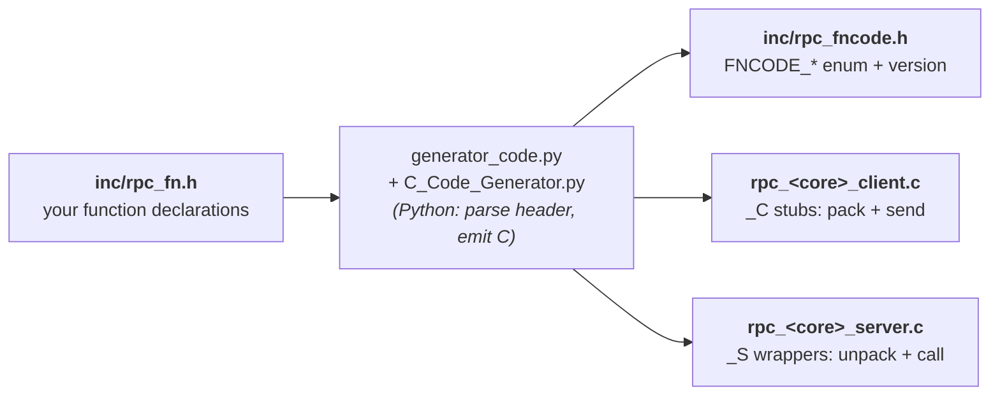

# RPC Framework — User Guide

This guide describes how to operate the multi-core RPC framework: declaring a
function, regenerating the stub files, and executing calls across cores. The
internal mechanisms (marshalling, stub structure) are documented in
**TECHNICAL_GUIDE.md**; the Android implementation is documented in
**ANDROID_GUIDE.md**.

---

## 1. Introduction

The framework allows code executing on one core to invoke a C function whose
implementation resides on a **different** core. The invocation is written as an
ordinary local function call:

```c
int sqr;
fn_compute_sqr(7, &sqr);   // written as a local call; executes on CORE2 and returns 49
```

The system comprises three cores. **Exactly one core acts as the hub (TCP server)**;
the remaining two are clients that connect to it. All client-to-client traffic is
relayed through the hub. The hub assignment is configurable, defaulting to CORE2
(see §4).

| Core | Typical role |
|------|--------------|
| CORE1 | the Android application (also buildable as a native process for testing) |
| CORE2 | a native C process (commonly the hub) |
| CORE3 | a native C process |

The single source of truth is **`inc/rpc_fn.h`**, which contains every function
prototype together with its core tag and argument directions.

> **CORE1 has two build paths.** In deployment it is the Android application (see
> **ANDROID_GUIDE.md**). For development it can also be built as an ordinary native
> process with `make core1`, which lets **all three cores run on a single machine**
> over loopback — see §1b.

---

## 1a. Quick Start

The following procedure builds the supplied demonstration and executes a call
from one core to another. A single machine can run **CORE2 and CORE3** (and, with
the native `make core1` build, CORE1 as well) as separate native processes.

**1. Generate and build** (from the `RPC_ReferenceFramework` directory):
```
python src/python_scripts/generator_code.py   # generates the stubs from inc/rpc_fn.h
make core2 core3                               # Linux: ./core2 ./core3   ·   Windows-MinGW: core2.exe core3.exe
```

**2. Start the hub, then a client** (two terminals on the same machine):
```
# terminal 1 — CORE2 is the default hub; no flag is required:
./core2
# terminal 2 — CORE3 as a client directed at the hub on this machine:
./core3 -s 127.0.0.1
```
On Windows, use `core2.exe` / `core3.exe`. For separate machines, substitute the
hub's LAN IP for `127.0.0.1`. The complete flag rules are given in §4.

**3. Invoke a function.** At either `rpc>` prompt, enter a command from the menu.
From the **CORE3** prompt, `sqr 7` executes on CORE2 and the result is returned to
the caller:
```
rpc> sqr 7
  fn_compute_sqr(7) = 49
```
From the **CORE2** prompt, `array 5 10 15` executes on CORE3 and the array is
echoed back. A command whose owning core is not connected (for example, any
`[CORE1]` command in this two-core setup) reports
`'…' is on CORE1, which is NOT connected yet.` rather than blocking. Enter `help`
to display the current menu and `quit` to exit.

### Demo Functions
| Command | Owner | Description |
|---------|-------|-------------|
| `mod <x> <y>` | CORE1 | computes `x % y` |
| `point <x> <y>` | CORE1 | returns the point `(x+1, y+1)` |
| `ver_core1` | CORE1 | reads CORE1's RPC version |
| `sqr <x>` | CORE2 | computes `x * x` |
| `ver_core2` | CORE2 | reads CORE2's RPC version |
| `hello <text>` | CORE3 | prepends `"Hello "` and echoes the result (`INOUT` string) |
| `array <n…>` | CORE3 | accepts a list of integers and echoes the array back (`INOUT` array) |
| `ver_core3` | CORE3 | reads CORE3's RPC version |

This demonstrates the central property of the framework: a call is written once
and executes wherever its function is implemented. §2 describes how to add a new
function, §3 describes the menu, and §4 describes execution across separate
machines and selection of the hub.

---

## 1b. Testing All Three Cores on a Single Machine

CORE1 is normally the Android application, but it can also be built as a native
process (`make core1`). This makes it possible to run **CORE1, CORE2 and CORE3
together on one machine** over the loopback address `127.0.0.1` — useful for
developing and testing the full RPC path (including client→hub→client relaying)
without any phone or second machine.

**1. Build all three native cores:**
```
python src/python_scripts/generator_code.py   # regenerate stubs (if rpc_fn.h changed)
make all                                       # builds core1 + core2 + core3
```
(`make all` builds all three; or build them individually with `make core1`,
`make core2`, `make core3`.)

**2. Start the hub, then the two clients — three terminals on the same machine.**
CORE2 is the default hub, so it needs no flag; the clients are pointed at the hub
with `-s 127.0.0.1`. Start the hub first so it is listening before the clients
dial:
```
# terminal 1 — CORE2 : the hub (default; no flag needed)
./core2

# terminal 2 — CORE3 : client
./core3 -s 127.0.0.1

# terminal 3 — CORE1 : client (native test build)
./core1 -s 127.0.0.1
```
On Windows (MinGW) use `core2.exe`, `core3.exe`, `core1.exe`. Each core opens its
own `rpc>` prompt, and every menu fills in to show the others as `(connected)` as
they join.

**3. Exercise local and remote calls.** With all three connected you can invoke
any core's functions from any prompt:
```
# at the CORE1 prompt:
rpc> ver_core1        ->  core1 version = 33          (local to CORE1)
rpc> mod 17 5         ->  fn_compute_mod(17, 5) = 2    (local to CORE1)
rpc> sqr 6            ->  fn_compute_sqr(6) = 36        (remote: runs on CORE2)

# at the CORE3 prompt:
rpc> ver_core3        ->  core3 version = 1            (local to CORE3)
rpc> sqr 9            ->  fn_compute_sqr(9) = 81        (remote: runs on CORE2)
```
A remote call (for example `sqr` from CORE1 or CORE3) is marshalled to the hub,
executed on the owning core, and the result is returned to the caller — exactly as
it would be across separate machines. Enter `quit` at each prompt to exit cleanly.

> **Ports on one machine.** Only the hub binds a port — the single shared port `8848`
> (see §4). The clients do not bind; they each dial `8848` from an OS-assigned ephemeral
> source port, so all three processes coexist on `127.0.0.1` without colliding.

> **CORE1 here is only a test build.** The native `core1` binary is for
> single-machine testing; the deployed CORE1 is the Android application built in
> Android Studio (see **ANDROID_GUIDE.md**). Both speak the identical wire
> protocol, so a native CORE1 and an Android CORE1 are interchangeable on the
> network.

---

## 2. Adding a New Function

A function is defined in one place — its prototype in `inc/rpc_fn.h`. Declaring it,
regenerating, and implementing the body is sufficient; the generator produces the
client stubs, the server wrapper, and the dispatch-table entry.

The following worked example adds **`fn_multiply(a, b) → a*b`** on **CORE2**.

### Step 1 — declare the prototype in `inc/rpc_fn.h`
```c
RPCFN_CORE2  enumRpcErr  fn_multiply (IN int a, IN int b, OUT int *pprod);
```
The declaration has three parts: the **core tag** (the core that executes it), the
return type (`enumRpcErr`), and the argument list with **direction** markers.

**Core tag — the core that owns (executes) the function:**

| Tag | Executes on | Implement the body in |
|-----|-------------|-----------------------|
| `RPCFN_CORE1` | CORE1 (Android) | `src/rpc_src/rpc_core1.c` |
| `RPCFN_CORE2` | CORE2 | `src/rpc_src/rpc_core2.c` |
| `RPCFN_CORE3` | CORE3 | `src/rpc_src/rpc_core3.c` |

**Argument markers** (empty macros that direct the generator's marshalling of each
argument):

| Parameter kind | Declaration | Notes |
|----------------|-------------|-------|
| input scalar / struct | `IN int x` · `IN sPoint p` | passed by value |
| output value | `OUT int *px` · `OUT sPoint *pp` | must be a pointer; populated on return |
| input and output | `INOUT int *px` | transmitted, then overwritten with the result |
| array | `IN RPCARR_SIZE int n, IN RPC_TYPE_ARRAY int *arr` | the `RPCARR_SIZE` argument must immediately precede the `RPC_TYPE_ARRAY` argument; its value determines the element count transmitted |
| output / echoed array | `IN RPCARR_SIZE int n, INOUT RPC_TYPE_ARRAY int *arr` | the caller allocates `n` elements; the size argument remains `IN` |
| string | `IN RPCARR_SIZE int len, IN RPC_TYPE_ARRAY char *str` | a `char` array; pass `strlen+1` so the terminator is transmitted |

Structures must be plain, fixed-size, and free of pointers, as they are copied
onto the wire with `memcpy`; `sPoint {int x, y;}` is the reference example. Every
function returns `enumRpcErr`.

> A function with any `OUT` or `INOUT` argument blocks until a reply is received
> (`has_output=1`). Functions with only `IN` arguments are fire-and-forget.

### Step 2 — regenerate the stubs
```
python src/python_scripts/generator_code.py   # reads inc/rpc_fn.h and regenerates all generated files
```

The generator's input and outputs:



This regenerates the following files, which must not be edited manually:
- `inc/rpc_fncode.h` — the `FNCODE_*` enum and `RPC_VERSION`.
- `src/rpc_src/rpc_core2_server.c` — the `fn_multiply_S` wrapper and its dispatch-table entry.
- `src/rpc_src/rpc_core1_client.c` / `rpc_core3_client.c` — the `fn_multiply` client stub, enabling the other cores to call it. CORE2's own client file does not contain the function; CORE2 calls its local body directly.

> `FNCODE` values are hashed from the function **name**, so adding or changing an
> argument does not renumber existing functions; regeneration is stable.

### Step 3 — implement the body in the owner's implementation file
In `src/rpc_src/rpc_core2.c` (standard C, since the markers expand to nothing):
```c
enumRpcErr  fn_multiply (int a, int b, int *pprod)
{
    *pprod = a * b;
    printf("[CORE2] fn_multiply: %d * %d = %d\n", a, b, *pprod);
    return RPCERR_SUCCESS;
}
```
For an array function, iterate using the size argument as the bound:
`for (i = 0; i < n; i++) sum += arr[i];`.

### Step 4 — register the command in the interactive menu (optional)
Two additions are made in `src/rpc_src/main_file.c`:

**(a) Menu entry** in `g_menu[]` (the fourth field is the owning core, displayed as
`[COREn]`):
```c
{ "mul", "mul <a> <b>", "fn_multiply           -> a*b", RPCCORE_CORE2 },
```
**(b) Dispatch branch**, alongside the `mod` and `sqr` branches:
```c
else if (0 == strcmp(cmd, "mul")) {
    int a, b, r = 0;
    if (2 == sscanf(line, "%*s %d %d", &a, &b)) {
        fn_multiply(a, b, &r);            /* local on CORE2, otherwise RPC */
        printf("  fn_multiply(%d, %d) = %d\n", a, b, r);
    } else printf("  usage: mul <a> <b>\n");
}
```
`fn_multiply(...)` is invoked identically on every core: the call executes locally
if the current core owns the function, and is otherwise dispatched as an RPC
(relayed through the hub where required).

### Step 5 — rebuild
```
python src/python_scripts/generator_code.py   # if not already regenerated in Step 2
make core2                                     # or: make core3 / make core1   (the Makefile selects -pthread / -lws2_32)
```
CORE1 is the Android application; for single-machine testing it can be rebuilt
natively with `make core1` (see §1b). When the function set changes, the Android
side must be regenerated as well; see **ANDROID_GUIDE.md**.

### Step 6 — run and invoke the function
Start the hub first (see §4), then the clients. At any client prompt:
```
rpc> mul 6 7
  fn_multiply(6, 7) = 42
```
The CORE2 terminal prints `[CORE2] fn_multiply: 6 * 7 = 42`, confirming that
execution occurred on CORE2 and the result was returned to the caller.

---

## 3. Interactive Menu

`print_help()` lists every function prefixed with the core that implements it
(`[CORE1]`/`[CORE2]`/`[CORE3]`) together with an availability tag: `(self)` for the
current core's own functions, `(connected)` when the owning core is present, and
`(NOT connected)` otherwise. The list is redrawn automatically as cores join or
leave the network.

```
===== CORE3 : function menu  ([COREn] = core that implements the function) =====
  [CORE1] mod <x> <y>    fn_compute_mod        -> x % y         (NOT connected)
  [CORE2] sqr <x>        fn_compute_sqr        -> x*x           (NOT connected)
  [CORE3] hello <text>   fn_print_hello -> "Hello <text>"       (self)
  [CORE3] array <n...>   fn_array_core3 -> prints/echoes ints   (self)
  help | quit
```

Entering a command whose owning core is not connected reports
`'x' is on CORE3, which is NOT connected yet.` rather than blocking.

---

## 4. Running Across Cores

Any core may serve as the hub. The hub must be started before the clients.

| Role | Launch command (desktop) | Notes |
|------|--------------------------|-------|
| hub / TCP server | `./core3 -S` | a bare `-S` designates this core as the hub; it binds all interfaces and requires no IP |
| client | `./core2 -s <hub_ip>` | `-s <ip>` designates a client; it requires only the hub's IP and never `-S` |

Example — CORE3 (Linux) is the hub; CORE2 (Windows) and CORE1 (phone) are clients:
```
# Linux            # Windows                       # Android (rpcclient2)
./core3 -S         core2.exe -s 192.168.31.38       enter 192.168.31.38, Connect
```

- **Role precedence:** `-S` / `setServerCore()` > `$RPC_SERVER_CORE` > default CORE2.
  Every core must resolve to the **same** hub.
- **TCP server IP precedence (clients):** `-s <ip>` > `$RPC_SERVER_IP` > `127.0.0.1`.
  Same machine → `127.0.0.1`; separate machines → the hub's LAN IP.
- **Ports:** a single shared port `8848` (the compiled-in `PORT` default in `osal.h`).
  The hub listens on `8848` for **every** client, and each client dials that same port.
  Each client announces its core id in a short handshake right after connecting, so the
  hub knows which core each connection is.
- A client retries for approximately 10 s before aborting; it waits only for its
  own link to the hub.

---

## 5. Build and Generation

The repository is organised as: headers in `inc/`, C sources in `src/rpc_src/`,
the Python generator in `src/python_scripts/`, and the Android projects in
`src/android_projects/`. The Makefile compiles from these locations (it passes
`-Iinc` for the headers).

```
python src/python_scripts/generator_code.py   # regenerate the stubs from inc/rpc_fn.h (required after any header edit)
make core2                  # build a core (on the machine that will run it)
make core3
make core1                  # native CORE1 build (for single-machine testing; see §1b)
make all                    # build all three (core1 + core2 + core3)
make clean
```
On Windows (MinGW), `make core2` produces `core2.exe` and links Winsock; on Linux
it links pthreads. The deployed CORE1 is built with Gradle/NDK as the Android app;
see **ANDROID_GUIDE.md**. `make core1` produces a native CORE1 binary for testing
only.

> Regeneration is required after any edit to `inc/rpc_fn.h`: the `*_client.c`,
> `*_server.c`, and `rpc_fncode.h` files are generated, and manual edits are
> overwritten.
