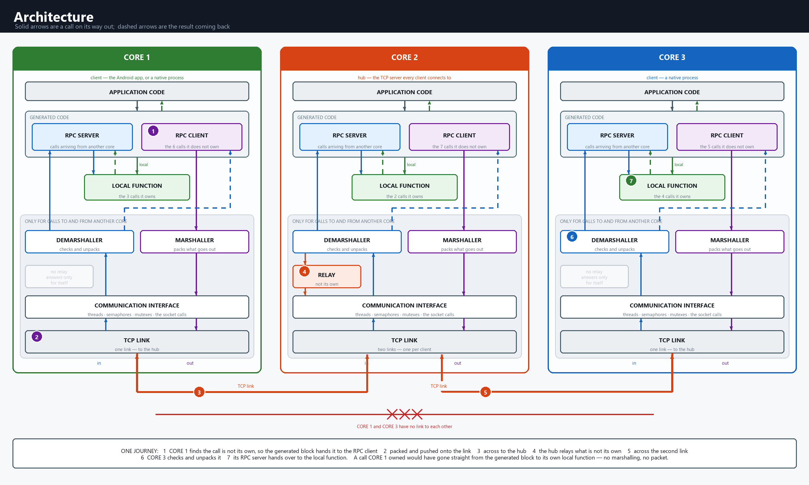

# Multi-Core RPC Framework

## Why use an RPC Framework?

**How do you make software running on different CPU cores, processes or machines communicate as easily as calling a local function?**

In multi-core and distributed automotive systems, applications often need to invoke functionality across execution boundaries. Hand-writing message formats, socket communication, marshalling and dispatch logic for every function increases development effort and creates maintenance overhead.

The **Multi-Core RPC Framework** automates this communication layer. Engineers declare a remote function once, and the framework generates the client and server stubs needed to marshal, transport, demarshal and dispatch the call. This allows teams to **simplify cross-core communication, reduce repetitive IPC code and accelerate integration of distributed software components**.

The framework is applicable to **multi-core embedded systems, automotive software, distributed applications, prototyping and IPC development**, with TCP used as the transport in this implementation.

The technical details of the framework are described below.

---

## Who This Is For

C developers who want code on one core (or process, or machine) to call a function
that lives on another — without hand-writing the messaging code. RPC works over
**any communication pipe** (TCP, UART, shared memory, …); **this framework uses
TCP**. Basic **C** and **TCP** knowledge is enough; no prior RPC experience needed.

---

## What is RPC?

**RPC** (Remote Procedure Call) is a mechanism that lets a program invoke a
function whose implementation resides in a different execution context — another
process, another CPU core, or another machine on a network — using the same
syntax as an ordinary local function call. Transport and message handling are
performed by the framework, not by application code.

In this framework the two endpoints communicate over **TCP**. One endpoint runs a
**TCP server** that listens for connections; the others connect to it as clients,
and every request and reply is carried over that TCP link.

On the calling side the function is a generated **stub** that shares the name of
the real function. When invoked, the stub performs four operations:

1. **Marshalling** — serializes the function identifier and its arguments into a
   single byte buffer suitable for transmission.
2. **Transport** — transmits the buffer to the remote endpoint (over a TCP socket).
3. **Demarshal & dispatch** — the remote endpoint deserializes the buffer back into
   arguments (demarshalling), then resolves the target function and invokes it
   (dispatch).
4. **Return** — the result is serialized, transmitted back, and deserialized, so
   the original call returns the value as an ordinary local call would.

The framework generates this glue, so application code never handles sockets,
byte buffers, or message formats directly. The same principle underlies
technologies such as gRPC, Java RMI, and Android's AIDL/Binder.

### Terminology

The following terms are used throughout the documentation:

| Term          | Definition                                                                |
|---------------|---------------------------------------------------------------------------|
| Caller        | The endpoint that initiates a call (per-call role).                       |
| Callee        | The endpoint that hosts and executes the target function (per-call role).  |
| Client        | A core that connects to the TCP server (network role).                    |
| TCP server    | The core that listens for TCP connections (network role); in this framework it is also the hub that relays traffic between clients. |
| Stub          | A generated function that shares the target's name and performs argument marshalling and transmission on the caller's behalf. |
| Marshalling   | Serializing the function identifier and arguments into a byte buffer for transmission. |
| Demarshalling | The inverse operation: deserializing a received buffer into arguments or a result. |
| Transport     | Conveying the buffer between endpoints (a TCP socket here).               |
| Dispatch      | Resolving the target function from a received message and invoking it.     |
| Hub / relay   | A central core that forwards messages between two cores not directly connected. |

---

## How This Framework Works

This project applies the RPC idea across **three cores** that talk over TCP
sockets. Its distinctive feature is that you never write the stubs by hand — you
declare a function once, and a Python generator writes the client and server code
for every core.

**Architecture.** The framework runs on **three cores**, and every core is built from
the **same stack of layers** shown below. Each core can both **call** functions that
live on the other cores and **run** functions that the others call — so every core is
a client and a server at the same time. Application code never touches sockets: an
outgoing call passes down through the generated stubs → **Marshaller** → **OS
Abstraction Layer (OSAL)** → the **TCP link**. CORE2 is the **hub (TCP server)**:
CORE1 and CORE3 each connect to it, and it **relays** messages between the two
clients, which have no direct link to each other. In the diagram, solid arrows show a
call on its way out; dashed arrows show the result coming back.



Each block in the diagram maps to a concrete part of this framework:

| Block in the diagram              | In this framework                                              |
|-----------------------------------|----------------------------------------------------------------|
| Application code                  | your code and the `rpc>` menu (`main_file.c`); on CORE1, the Android app |
| RPC Client / RPC Server (generated) | the generated stubs — `rpc_<core>_client.c` (`_C`) / `rpc_<core>_server.c` (`_S`), declared once in `rpc_fn.h` |
| Marshaller / Demarshaller         | `rpc_marshall.c` (`rpc_marshal` / `rpc_demarshal`)             |
| Local Function                    | your target implementations, invoked by the `_S` server stubs  |
| OS Abstraction Layer (OSAL)       | `osal.c` / `os_platform.h` — sockets, threads, mutex/semaphore, memory |
| TCP link                          | `os_send_rpc_buffer` → `send()` on a TCP socket, shared port `8848` |
| Relay (CORE2 hub only)            | `rpc_demarshal` forwards any frame whose destination is the other client |

**Worked example — CORE1 calls a function on CORE3:**

1. **CORE1** marshals the request (function name + `IN`/`INOUT` args), stamping the
   header with **source = CORE1, destination = CORE3**, and sends it over its TCP link
   to the hub.
2. **CORE2 (hub)** reads the destination field, sees it is *not* CORE2, and **relays
   the frame unchanged** down its TCP link to CORE3 — it does not demarshal the body.
3. **CORE3** de-marshals the request, its `_S` server stub dispatches the **Local
   Function**, then marshals the reply with **destination = CORE1**.
4. The reply retraces the path: CORE3 → hub → CORE1, where CORE1 de-marshals the
   `OUT`/`INOUT` results and the original call returns.

If CORE1 instead calls a function hosted on **CORE2**, the hub takes the *local*
branch: it de-marshals, dispatches to its own `_S` stub, and marshals the reply
straight back — no relay hop.

**The flow, end to end:**

1. **Declare** — You add a function prototype to `rpc_fn.h`, tagging *which core*
   implements it and the *direction* of each argument (`IN`, `OUT`, `INOUT`).

   Template:
   ```c
   RPCFN_<CORE>   enumRpcErr   <function_name> ( <DIR> <type> <arg>, ... );
   ```
   Example:
   ```c
   RPCFN_CORE2  enumRpcErr  fn_compute_sqr (IN int x, OUT int *psqr);
   ```

2. **Generate** — Running `python src/python_scripts/generator_code.py` reads
   `rpc_fn.h` and emits:
   - `rpc_core*_client.c` — the caller-side stubs that marshal arguments and send.
   - `rpc_core*_server.c` — the callee-side stubs that demarshal and call the real
     function.
   - `rpc_fncode.h` — a function-code table (a hash of names) used for dispatch.

   ```
     rpc_fn.h  ──►  generator_code.py + C_Code_Generator.py  ──►  rpc_fncode.h            (FNCODE_* enum + version)
     (declarations)        (Python: parse the header, emit C)         rpc_core*_client.c      (_C stubs: pack + send)
                                                                      rpc_core*_server.c      (_S wrappers: unpack + call)
   ```
   *Input: the prototypes in `rpc_fn.h`. Outputs: the shared code table
   (`rpc_fncode.h`) and the per-core client (`_C`) and server (`_S`) stubs. See
   `TECHNICAL_GUIDE.md` §2 for the full specification.*

3. **Marshal & send** — When any core calls `fn_compute_sqr(...)`, the generated
   client stub calls the marshalling engine (`rpc_marshall.c`), which packs the
   arguments — respecting `IN`/`OUT`/`INOUT` — into a message with a header, and
   sends it through the OS abstraction layer (`osal.c`).

4. **Relay through the hub** — One core is the **hub (TCP server)**; the other two
   are clients connected to it. If a client needs a function on another client, the
   hub relays the message. This keeps the network simple (a star, not a mesh).

5. **Demarshall & dispatch** — The receiving core demarshals the arguments, looks up
   the function in its table, and calls the real implementation.

6. **Return** — Any `OUT`/`INOUT` results are marshalled back to the caller, whose
   original call then returns — exactly like a local function.

**What each piece does:**

| Layer                  | File(s)                        | Responsibility                                    |
|------------------------|--------------------------------|---------------------------------------------------|
| Function declarations  | `rpc_fn.h`                     | Single source of truth for all RPC functions.     |
| Code generator         | `generator_code.py`, `C_Code_Generator.py` | Emits stubs + dispatch tables from `rpc_fn.h`. |
| Generated stubs        | `rpc_core*_client.c` / `rpc_core*_server.c` | Per-core marshal (client) and dispatch (server).  |
| Marshalling engine     | `rpc_marshall.c`, `rpc_marshall.h` | Wire format, packing/unpacking, headers.      |
| OS abstraction (OSAL)  | `osal.c`, `osal.h`, `os_platform.h` | Sockets, threads, mutex/semaphore, memory.   |
| Entry point            | `main_file.c`                  | Starts a core and its menu.                       |

Because the generator and the OS layer absorb all the plumbing, adding a new
remote function is a one-line declaration plus its implementation — see
[Adding a Function](#adding-a-function) below.

---

## Reference Project Layout

```
inc/                  headers (rpc_fn.h, rpc_fncode.h, rpc_marshall.h, osal.h, ...)
src/rpc_src/          C sources (main_file.c, osal.c, rpc_marshall.c, rpc_core*.c)
src/python_scripts/   the code generator (generator_code.py, C_Code_Generator.py)
src/android_projects/ Android apps (aidlserver.zip, rpcclient2.zip) for CORE1
Docs/                 USER_GUIDE, TECHNICAL_GUIDE, ANDROID_GUIDE
Makefile              builds the native cores
```

## Cores

- **CORE1** — in this framework, the **Android app**, built with Android Studio /
  Gradle (see `ANDROID_GUIDE.md`) — **not** with `make`. A native stand-in
  *can* be built with `make core1`, but only for single-machine testing without a
  phone; the deployed CORE1 is always the Android app.
- **CORE2** — native C process (default hub / TCP server)
- **CORE3** — native C process (client)

One core is the hub; the others connect to it over TCP (port `8848`).

## Usage

**1. Generate the stubs** (after any edit to `rpc_fn.h`):
```bash
python src/python_scripts/generator_code.py
```

**2. Build.** CORE2 and CORE3 are native C processes — build each with `make` on
the machine that will run it. **CORE1 is the Android app**: build it with Android
Studio / Gradle (see `ANDROID_GUIDE.md`), *not* with `make`.
```bash
make core2      # hub    (native C process)
make core3      # client (native C process)
make clean      # remove built binaries
```

**3. Run** — start the hub first, then the client (point it at the hub's LAN IP):
```bash
./core2                 # hub
./core3 -s <hub-ip>     # client
```

### Optional: all three cores on one machine (no phone)

For a quick end-to-end test without a phone, CORE1 can be compiled as a **native
stand-in** with `make core1`. This binary is for testing only — it is *not* the
deployed CORE1 (which is always the Android app), but it speaks the identical wire
protocol, so it is interchangeable on the network. You can then run all three cores
over loopback:
```bash
make all                     # core1 (native stand-in) + core2 + core3
./core2                      # hub
./core3 -s 127.0.0.1         # client
./core1 -s 127.0.0.1         # native CORE1 stand-in (not the Android app)
```
See `USER_GUIDE.md` §1b.

## Adding a Function

1. Add a prototype to `rpc_fn.h`, tagging the core and argument directions:
   ```c
   RPCFN_CORE2  enumRpcErr  fn_compute_sqr (IN int x, OUT int *psqr);
   ```
2. Run `python src/python_scripts/generator_code.py`.
3. Implement the function on its target core and rebuild.

## Docs

Full documentation is in [`Docs/`](Docs): `USER_GUIDE.md`,
`TECHNICAL_GUIDE.md`, and `ANDROID_GUIDE.md`.

## Licence

MIT — see [`LICENSE`](LICENSE). Copyright (c) 2026 Prajnaana Technologies
Pvt. Ltd. Every source file carries the same notice as an `SPDX-License-Identifier`
line, generated files included: the generator emits it, so a regenerated file
keeps it.
